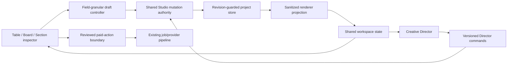

# Creative Studio 2 — Table, Board, and Director Workspace

**Status:** Approved in design conversation; awaiting written-spec review
**Date:** 2026-08-17
**Baseline:** `integration/studio-director` at `21bf87ae1674598bd42ea88c5f13c74e8389b3c0`
**Phase:** 2B — Section → Clip → Take and Table/Board review

## 1. Decision

Creative Studio's next product slice is the real Table and Board workspace, not a cosmetic pass over
the existing Write / Produce / Review shell. The slice introduces the Section → Clip → Take model and
lets the renderer and Creative Director operate on the same revision-guarded project through one
mutation authority.

**Owner decision, 2026-08-17:** Creative Studio has no production users or durable customer projects.
Schema-1 projects, pending records, and drafts are internal prototype/test data and are disposable.
Phase 2B therefore makes a clean schema-2 cutover and does not build a production migration system.
This decision must be revisited before the first external user or any promise of durable Studio data.

The supplied interactive HTML is the desktop visual authority. A byte-identical copy is tracked
beside this specification so the authority survives local Downloads cleanup:

- Tracked raw fixture:
  [`creative-studio-2-table-board-reference.html.txt`](./creative-studio-2-table-board-reference.html.txt)
- Supplied from: `/Users/lap16603/Downloads/Creative Studio 2 - Table and Board.html`
- SHA-256: `875258f85ad4717fd3b1019ae3096db3394325c81ae1787f1d07b448b2ebe366`
- Size: 3,720,487 bytes
- Last modified: 2026-08-13 11:58:53 +07:00
- Inspected states: Table and Board at 1600 × 1000

The reference is a frozen generated fixture, not implementation source and not a packaged runtime
asset. It is stored with a final `.txt` suffix so repository viewers do not execute its bundled
scripts or font preconnect hints. Human visual inspection copies it to a temporary `.html` file and
uses a network-isolated browser. The file is replaced whole only from a newly approved source with a
new recorded hash; line-level maintenance or formatter rewrites are forbidden.

The reference controls hierarchy, density, spacing, palette, typography roles, table rhythm, card
treatments, selection language, overlays, and desktop layout. This specification overrides the
reference where the prototype promises behavior the product does not yet safely support, most
notably generic undo, Cut, and Export.

## 2. Outcome

A user can write, organize, inspect, select, and review a complete Studio project from one workspace
without returning to the old phase navigation. Table and Board are two views of the same canonical
state. The Director is a second operator of that state, not a chat drawer covering it.

The slice succeeds when:

1. New projects in fresh development/test profiles open directly in the Section → Clip → Take model.
2. Table and Board closely match the supplied desktop reference and remain usable at narrower
   widths.
3. Renderer edits and Director edits share one transactional, revision-aware mutation path.
4. Chat never overlays the active Table or Board workspace on wide or medium layouts.
5. Paid generation still requires the existing reviewed human confirmation.

## 3. Scope

### In scope

- Versioned Section → Clip → Take project model and clean development-data cutover.
- Versioned Director operations for section, clip, ordering, and take selection.
- One project workspace with a persistent project header and Table / Board switch.
- Functional Table, Board, section inspector, selection bar, and Board shelf.
- Responsive Director presentation: docked, split, or explicit full-screen.
- Field-granular local drafts, conflict handling, and canonical rebase.
- Explicit loading, empty, failure, stale, capacity, partial-generation, and unsupported-prototype
  states.
- Keyboard and screen-reader operation, reduced-motion behavior, and all configured locales.
- Visual and human comparison against the supplied reference.

### Out of scope

- Cut redesign, export redesign, folder mirroring, first/last-frame chains, or audio.
- General Director undo, recovery checkpoints, or an `Undo all` control; those remain Phase 2C.
- Direct paid action by the Director, provider changes, route procurement, or generation-policy
  changes.
- Spatial canvas, multi-track editing, keyframes, grading, crop, filters, or aspect-ratio variants.
- Default enablement, release acceptance, or removing the existing Creative Studio feature flag.
- Production migration or backward compatibility for schema-1 prototype data.

Cut and Export controls from the prototype do not appear as convincing but nonfunctional actions.
They remain unavailable until their owning phases ship.

## 4. Product principles

1. **One project, two operators.** Renderer and Director use the same commands and revision rules.
2. **Table is for precision; Board is for visual judgment.** They do not maintain separate state.
3. **Free edits may be direct; paid work always confirms.** UI fidelity cannot weaken spend fences.
4. **Schema-2 drafts are not disposable.** Canonical updates rebase around local field dirtiness.
5. **Capability honesty.** Unavailable, ambiguous, partial, or destructive behavior is stated before
   action.
6. **No fake recovery.** CAS and receipts prevent stale or ambiguous writes; they are not undo.
7. **Chat is workspace chrome, not an obstruction.** It never appears over work unexpectedly.

## 5. Architecture

The current phase-oriented page becomes a project workspace. Existing main-process storage,
generation, media, and reviewed-spend services remain authoritative.



### Renderer boundaries

The renderer remains page-private under `pages/studio/`. The old `PhaseShell` responsibility is
replaced rather than adding another peer to an already crowded component directory. The target
workspace module owns:

- `WorkspaceShell` — header, view routing, responsive panes, and overlay host.
- `TableView` — section rows and table-specific presentation.
- `BoardView` — section cards, grid, shelf, and board-specific presentation.
- `SectionInspector` — shared section/clip/take editor used by both views.
- `SelectionBar` — shared selection summary and bulk actions.
- `DirectorLayout` — docked/split/full-screen placement without remounting the conversation.

`StudioPage` remains the orchestration boundary, but mutation, draft, selection, and review logic
move into focused hooks or pure modules. New page-private modules follow the repository's ≤10 direct
child rule; the implementation plan must include the necessary replacement/moves rather than
ratcheting existing directory violations.

### Process boundaries

- Shared wire and persisted types remain in the common layer.
- Pure schema validation and mutation transforms remain independent from filesystem and IPC.
- The main Creative Studio service validates and commits all renderer and Director writes.
- The renderer never imports process modules or reconstructs operational job/media state.
- Existing bridge calls may be versioned or replaced, but no duplicate mutation implementation is
  introduced in preload or renderer code.

## 6. Persisted model

The project manifest starts its supported contract at schema version 2.

```text
Project
├── Brief, rules, cast, look, routing, format
├── sectionOrder: SectionId[]         active sections
├── sections: Record<SectionId, Section>
│   ├── title / storyLine
│   ├── visualPrompt                  inherited visual direction
│   └── clipOrder: ClipId[]
├── clips: Record<ClipId, Clip>
│   ├── shotPrompt                    clip-specific action/composition
│   ├── narration / onScreenText
│   ├── mediaKind
│   ├── durationSeconds               4–15 for generated video clips
│   ├── references / jobs
│   └── Take IDs                      immutable global assets; one selected
├── ShelfItem[]                       parked section or asset identities
└── Schema-2 cuts and operational records
```

Section duration, readiness, render state, and issue badges are derived from clips. They are never
persisted as competing author-editable values. Takes remain in the project's global immutable asset
registry; clips hold bounded asset IDs and the selected-take ID rather than embedding media records.
Section and clip IDs are immutable and unique within a project. Every section is either active or
parked exactly once; every clip belongs to exactly one section's `clipOrder`; every clip-owned asset,
job, reference, and cut relation resolves to that clip. Validation rejects orphaned, duplicated, or
cross-owned identities.

The shelf is an ordered persisted union of `{ kind: 'section', sectionId }` and
`{ kind: 'asset', assetId }`. A parked section remains in the section map but leaves active
`sectionOrder`; its clips, takes, jobs, and authored fields remain intact. Active duration, selection,
and rendering exclude parked sections.

Shelf membership has two exact meanings:

- A section item is exclusive active-order membership: the section ID appears in either
  `sectionOrder` or the shelf exactly once, never both.
- An asset item is a presentation alias, not ownership. It may reference only a canonical generated
  take that remains reverse-linked from its owning clip. Imports, thumbnails, reference plates,
  renders, foreign assets, and duplicate shelf IDs are rejected. A shelved take is not selected and
  is not referenced by a cut.

### Capacity

- Maximum sections across active and parked sections: 24.
- Maximum clips per section: 8.
- Maximum clips per project: 96.
- Video clips must be 4–15 seconds; routes may impose a narrower supported set.
- Take lists remain immutable asset collections and use bounded renderer/MCP projections.

Schema-2 validators and every mutation enforce these limits strictly. No runtime path truncates,
normalizes, or attempts to grandfather schema-1 values into this model.

The implementation plan must centralize these independently named limits. Generation-request,
reference-request, cut-placement, and dirty-report limits remain separate contracts even when their
current numeric value matches.

## 7. Clean schema-2 cutover

No product migration runs. Schema 2 is the first supported persisted contract for this workspace.
New projects and test fixtures are created directly with sections, clips, takes, and an empty shelf.
Session drafts, Director commands, proposals, reference requests, and cut records use only their new
versioned schema-2 identities.

A schema-1 manifest or sidecar returns the bounded `unsupported_prototype_schema` state. It is never
silently converted, quarantined as corrupt, presented as an empty project, replayed against schema 2,
or allowed to trigger provider work. The internal UI links to fresh development-profile instructions;
it does not ship a customer migration/reset flow.

Gate 1 and all automated tests use fresh, explicitly named development/test profiles and create
schema-2 seed data directly. Existing prototype profiles remain untouched. A developer who no longer
needs one may remove it through the repository's existing profile-cleanup workflow, outside this
feature; Phase 2B adds no reset command and no destructive startup behavior.

### Cut model boundary without Cut UI

Schema-2 `StudioCutClip` uses `clipId`; `sceneId` is not part of the supported schema-2 contract.
Cleanly seeded projects start without pre-v2 cut records.

Schema-2 cut reconciliation is clip-aware:

- the active render projection includes only clips whose owning section is active, whose clip is in
  that section's active `clipOrder`, and whose selected take is canonical;
- parked-section cut entries remain dormant in the cut map rather than being deleted, so restoring a
  section restores its cut decisions;
- storyboard-order cuts derive active order from `sectionOrder` then each section's `clipOrder`;
- manual-order cuts retain their complete order and filter dormant entries only in the render
  projection;
- selecting another take updates the cut entry's asset and clamps trims through the existing
  duration-safe rule;
- a new selected clip receives a cut entry only in storyboard-order mode;
- deleting a dependency-free clip is permitted only when no cut entry names it.

These are main-process foundation rules. They do not expose or redesign the Cut UI in Phase 2B.

## 8. Shared mutation contract

The schema-2 mutation vocabulary covers:

- set brief;
- add, edit, reorder, park, and restore section;
- add, edit, delete, and reorder a dependency-free clip within a section;
- park a canonical non-selected/non-cut take, select a shelved take for its owning clip, remove a
  shelf alias, and reorder shelf identities;
- select take for a clip.

Each batch:

1. Carries project ID, expected revision, version, and an ordered bounded operation list.
2. Rechecks revision, deadline, capacity, and semantic validity inside the store queue.
3. Applies against one immutable draft; later operations see earlier operations.
4. Preserves jobs, assets, provider identity, cuts, references, and rule-list undo unless an exact
   operation owns the relevant authored field.
5. Produces one project revision and one durable result.
6. Never invokes generation, retry, provider submission, polling, or rendering.

Parking a take adds only the shelf alias; clip ownership and reverse links remain unchanged. Selecting
a shelved take atomically removes its shelf alias and updates the owning clip's selection through the
canonical take predicate and cut reconciliation. The previously selected take remains an ordinary
unselected take and is not shelved implicitly.

Renderer mutations and Director commands call the same pure helpers. Error types are bounded and
machine-readable; UI copy never depends on parsing exception prose.

### Draft and conflict behavior

- Draft dirtiness is tracked per authored field at section and clip level.
- A canonical change to an untouched field is adopted immediately.
- A canonical change to a locally dirty field preserves both values and marks an explicit conflict.
- No adoption event triggers an implicit save.
- Explicit save uses the newest adopted canonical revision.
- Stale save refetches and re-runs field comparison; it does not auto-retry or overwrite.

## 9. Workspace shell

The project header contains:

- project name and project menu;
- Brief/rule status;
- cast/look summary;
- target and current duration;
- aspect ratio;
- Table / Board view switch;
- reviewed Render selected entry.

Switching Table/Board changes presentation only. It does not save, refetch, discard drafts, reset
selection, remount Chat, or change ordering.

The selection bar is sticky inside the workspace and reports section count, clip count, and total
duration. It offers Select ready, Clear, and Render selected. Sections without required authored
input cannot be selected for rendering and explain why. Parking a selected section removes it from
the current UI selection; restoring it appends it to active `sectionOrder` and does not select it
implicitly.

## 10. Table

Table is the precise writing and planning view.

Each section row displays:

- selection control;
- ordinal and title;
- story line;
- inherited visual prompt;
- clip count;
- derived duration;
- canonical state and actionable issue summary.

Each row contains a separately named selection checkbox, section-title button, drag handle, and Move
earlier/later actions. Pointer activation on the title or noninteractive authored cells opens the
inspector; Enter on the title button does the same. Space toggles only the focused checkbox.
Shift+pointer/Space extends selection from the last selection anchor through the current visible
canonical order. Select ready operates on that order and never selects a blocked section.
Pointer drag and Move earlier/later share the Board reorder mutation, keep focus on the moved section
ID, and announce its new global position. The final row contains a named Add section button that adds
the section and its first clip atomically.

Long text wraps or opens in the inspector; it is not hidden behind title-only truncation. At medium
width, secondary detail condenses into a second line while title, story line, state, duration, and
selection remain visible.

When workspace inline size falls below 720px, Table mode becomes a labelled section list rather than
a horizontally clipped grid. Each item exposes the same field names, selection checkbox, title
button, state, duration, and actions in canonical order. This is a presentation change only; it does
not create a second projection or hide authored text.

## 11. Board

Board is the visual review and sequencing view.

Each card represents one section. Cover choice is derived and is never persisted as a second source
of truth. The cover is the first clip in that section's `clipOrder` whose selected asset passes the
canonical generated-take predicate and has a usable managed preview. This deterministic choice is
shared by the Board projection and its tests.

When no clip supplies a usable cover, the placeholder precedence is rendering, failed or blocked,
ready to render, then missing input/no clips. The card's aggregate state badge is derived separately
across all clips, so a selected cover cannot hide that another clip is rendering or blocked. Cards
distinguish:

- complete/available;
- ready to render;
- rendering with progress;
- failed or blocked;
- rule breach;
- missing visual prompt;
- no clips;
- selected.

Board is a named list; each list item contains a distinct selection checkbox, section-title button,
drag handle, and Move earlier/later actions. The card container is not itself an ambiguous composite
button. Enter on the title opens the inspector; Space on the checkbox and Shift+Space follow the same
selection rules as Table. Pointer drag reorders sections. Move earlier/later provides the exact
keyboard operation, keeps focus on the same section ID, and announces its new global position.
Card selection is shared with Table.

The Board grid uses container-driven columns with a 240px minimum card width and becomes one column
below 520px. The shelf follows the card list in narrow workspace mode; the selection bar wraps into
two rows; the inspector becomes a full-screen sheet below 720px. None of these presentations cover
the Director full-screen mode.

### Shelf

The Board shelf contains parked takes and parked sections. The action is named Move to shelf, not
Delete: it parks authored and generated content instead of implying media destruction. Restoring an
item uses a revision-guarded mutation, appends the section to active order, and restores dormant cut
decisions. Permanent section deletion is absent from this slice; any future introduction requires a
separate explicit destructive-flow design.

Only active sections participate in Table/Board selection and Render selected. A parked section and
its clips remain inspectable from the shelf but cannot become payable input until restored. Parking
or restoring never starts, cancels, retries, or otherwise mutates an existing job.

Focus follows identity through shelf mutations. Move to shelf opens/reveals the shelf and focuses the
new section item; Restore navigates to and focuses the restored section title. Removing or selecting
an asset alias focuses the next shelf item, then the previous item, then the shelf heading. Deleting
a dependency-free clip focuses the next clip, previous clip, or Add clip action. Reorder keeps focus
on the moved section ID. If an inspector's invoking node no longer exists,
focus falls back to that identity's new shelf/active representation, then the owning section heading,
then the current Table/Board view switch.

A clip with assets, jobs, or cut dependencies cannot be deleted. An empty dependency-free authored
clip may be deleted explicitly. Moving a whole section to the shelf is the safe operation for
preserving populated clip history.

Card size controls affect presentation only and do not persist project data.

## 12. Section inspector

The inspector is one shared editor mounted from Table or Board. It contains:

- section title, story line, and inherited visual direction;
- ordered clips with duration and authored shot instructions;
- clip-level narration, on-screen text, media kind, and references;
- available takes with selected-take control;
- generation/job state expressed without provider IDs or raw paths;
- conflict comparison when a local draft and canonical value diverge.

The inspector uses a dialog/sheet appropriate to available space, traps focus only while modal, and
returns focus to the originating row/card. Closing with unsaved fields requires Keep editing or
Discard; it never silently flushes.

Sections show at most eight clips. Clip reorder keeps focus on the moved clip ID and announces its new
position. Add clip is disabled at the section or project capacity boundary.

## 13. Creative Director layout

The Director conversation has one DOM owner for the project session. Layout moves/presents that owner
without recreating the conversation.

### Wide — at least 1280px

- Breakpoints use the `StudioWorkspaceShell` content-box inline size reported by `ResizeObserver`, not
  the browser window; app navigation and scrollbars are therefore already excluded.
- Docked 320–352px rail and at least 928px of workspace.
- Workspace consumes the remaining width.
- User may resize within a bounded range or collapse the rail.
- The rail never overlays Table or Board.

### Medium — 900–1279px

- Director is collapsed by default unless the user explicitly opens it.
- Opening creates a resizable 280–352px split, capped at 40% of the shell, and leaves at least 548px
  of workspace. A saved width is clamped to those bounds.
- It does not use the current overlay drawer behavior.

### Narrow — below 900px

- Director and workspace are explicit full-screen modes.
- A persistent, named Back to Table/Board action returns to work.
- Chat never opens automatically on top of the workspace.

At every size, Director and workspace are sibling grid regions or mutually exclusive full-screen
regions; their border boxes never intersect. If host geometry cannot satisfy the current split's
minimums, the shell uses the narrow full-screen pattern rather than overlaying either region.

### Preserved state

All layout transitions preserve:

- conversation identity and streaming response;
- scroll position;
- composer draft;
- proposals and required actions;
- tool history expansion;
- selected-section scope.

The conversation owner stays mounted. Any presentation that is not visible is both `inert` and
`aria-hidden`; it cannot retain tab stops. Explicit user open intent survives wide/medium resizing
when the minimums still fit. Crossing into narrow keeps workspace visible unless Director was the
active focused region; crossing back restores the user's prior explicit open/collapsed preference.
No breakpoint opens Chat merely because a section is selected or a response is streaming.

Selecting a section updates a scope chip but does not reveal Chat. An explicit Ask Director action
may reveal it through the appropriate dock/split/full-screen transition. Collapsed presentation
shows bounded unread, streaming, and required-action indicators.

Conversation and workspace scroll independently. Composer stays pinned. Brief summary, tool history,
and proposals are independently collapsible so no one block consumes most of the rail.

The wide/medium resize boundary is a focusable `separator` named Director width, with current,
minimum, and maximum values. Left/Right Arrow changes one step, Shift+Arrow changes a larger step,
and Home/End chooses the bounds; direction follows logical inline start/end. Opening Director
restores focus to its last focused control, or its named heading on first open. Back to Table/Board
and Collapse Director return focus to the identity of the control that opened it, with the workspace
view switch as fallback. A breakpoint change never leaves focus inside hidden or inert conversation
content; when the focused presentation must close, focus moves to the visible Director toggle without
remounting the conversation.

## 14. Paid-action boundary

Render selected opens the existing generation review with a canonical snapshot. The first
confirmation after any external revision refetches and rebuilds the review; it submits nothing. A
second explicit confirmation is required against the refreshed revision.

Selection may span any number of active sections. The review derives one ordered, de-duplicated list
of payable clip IDs from the selected sections. The existing generation request accepts 1–24 payable
clips. With zero payable clips, Render selected is disabled as Nothing to render. With 25 or more, it
is disabled with Select fewer clips to render; the UI reports the exact payable count. One
confirmation never silently chunks the set, creates multiple jobs, or submits only its first 24
clips.

Revision drift invalidates both the reviewed IDs and their count. The first confirmation after drift
submits zero work and rebuilds the review. A second confirmation is available only when the refreshed
set still contains 1–24 payable clips; otherwise the user returns to selection.

The Director may author free project fields but cannot submit scenes, retry jobs, select providers,
or invoke adapters. Static dependency checks and dynamic poison spies enforce that boundary.

## 15. States and errors

The UI must distinguish at least:

- loading project;
- empty project;
- unsupported prototype schema with fresh-profile development instructions;
- stale revision;
- same-field conflict;
- invalid clip duration;
- section or clip capacity reached;
- missing prompt or clips;
- route unavailable or ambiguous;
- rendering and partial progress;
- generation failure and retry eligibility;
- missing selected take/media;
- ambiguous Director command result;
- referenced managed media unavailable.

Every state states consequence and next safe action. Storage or unsupported-schema failures do not
masquerade as empty projects. `unconfirmed` or `indeterminate` never means retry automatically.

## 16. Visual system

The implementation reproduces the supplied reference through semantic tokens and component styles:

- warm ivory workspace and panel surfaces;
- orange reserved for primary action and active selection;
- compact mono labels for metadata, identifiers, and technical state only;
- sans-serif hierarchy for titles, authored text, and actions;
- dense but readable table rows;
- restrained borders, radii, shadows, and striped placeholders;
- clear selected, ready, rendering, blocked, empty, and breach treatments.

No copied inline-style wall is accepted. Use Arco interactive components, Icon Park icons, semantic
color tokens, UnoCSS for simple layout, and CSS Modules for complex page-private styling. The design
may adapt spacing at narrow widths but not revert to the old visual hierarchy.

## 17. Accessibility and localization

- Table mode uses native table semantics when the table presentation is active; its narrow labelled
  list exposes the same field names, selection state, and global order without counterfeit row roles.
- Board uses one named list with keyboard-equivalent reorder actions; CSS grid is presentation only
  and does not change its accessibility model.
- The Table/Board switch is a navigation region named Workspace view. Its localized controls expose
  `aria-current="page"`; activation focuses exactly one programmatic view heading whose visible
  localized text matches the selected switch label.
- Selection, progress, Director-applied edits, conflicts, and reorder results are announced.
- Dialogs have names, focus entry, Escape behavior, and focus return.
- Director split resizing, collapse, full-screen entry, and Back navigation are fully keyboard
  operable and preserve a logical focus return target.
- Color is never the sole state cue.
- Targets meet desktop pointer size requirements and visible focus is never removed.
- Reduced motion suppresses nonessential transitions.
- Text zoom and long translations wrap without clipping or title-only access.
- All renderer-visible copy lands in every configured locale with placeholder/plural parity.

The Board shelf is a named ordered list. Every item has an explicit section/take label, a drag handle,
Move earlier/later actions, and type-appropriate Restore, Select take, or Remove alias actions; none
relies on a card-wide click target. Shelf reorder uses the same pointer/keyboard and announcement
pattern as section reorder.

Layout uses logical CSS properties. In `fa-IR`, workspace order, Director docking, resize direction,
card/list alignment, and directional icons mirror without changing canonical section order. Authored
text uses `dir="auto"`; IDs, hashes, paths, durations, and other technical runs use isolated
left-to-right `bdi` spans so mixed-direction content cannot reorder adjacent labels. RTL behavior is
tested at every responsive boundary.

Accessibility overrides pixel fidelity when they conflict. Normal text meets 4.5:1 contrast, large
text and non-text controls meet 3:1, metadata is at least 12 CSS px, primary body/action copy is at
least 14 CSS px, and every row/card/shelf control has at least a 28 × 28 CSS-pixel hit area. Any
intentional departure from the supplied prototype's colors, tiny labels, or control size is recorded
as an accessibility correction in the visual-comparison gate.

## 18. Performance

- Compliant projects render up to 24 sections without virtualization, preserving native Table
  semantics and predictable focus.
- Board images use managed URLs, bounded previews, and lazy loading.
- View switching does not refetch or remount the Director.
- Draft updates do not serialize the full project on every keystroke.
- Reorder and selection remain responsive at 24 sections and 96 clips.
- Existing Director receipt and paid-spend latency constants are unchanged unless a separate measured
  contract justifies revision.

## 19. Delivery gates

### Gate 1 — schema and mutation foundation

- Schema-2 types and exact validators.
- Fresh-profile schema-2 seed and fixture coverage.
- Shared section/clip/take mutation helpers.
- Versioned Director/proposal behavior and explicit schema-1 rejection.
- No renderer behavior change.

### Gate 2 — workspace shell and Director layout

- Replace phase navigation with the project header and view state.
- Dock/split/full-screen Director behavior with one mounted conversation.
- Shared selection state and overlay host.
- Preserve current project loading and reviewed paid actions.

### Gate 3 — functional Table

- Section rows, inspector, clips/takes, drafts/conflicts, selection, reorder, and render review entry.
- Desktop visual comparison and medium/narrow behavior.

### Gate 4 — functional Board

- Cards, states, selected covers, drag/keyboard reorder, shelf, shared inspector and selection.
- Desktop visual comparison and responsive grid.

### Gate 5 — hardening and human acceptance

- Accessibility, localization, recovery, strict capacity, performance, spend fence, and complete test
  gates.
- Human walkthrough comparing Table and Board to the supplied reference.

Each gate receives an independent diff review and must resolve Critical/Important findings before the
next gate consumes its contract.

## 20. Verification

Automated verification includes:

- schema-2 fixtures with assets, jobs, references, cuts, selected takes, shelf items, and every strict
  capacity boundary;
- schema-1 manifest/sidecar rejection in an untouched prototype profile plus fresh-profile schema-2
  seed behavior and zero paid/provider calls;
- exact schema keys, versions, malformed-record handling, and restart behavior;
- mutation precedence, one-revision atomicity, rollback, and dirty-field rebase/conflict tests;
- Table and Board DOM interaction and shared-selection tests;
- deterministic Board cover/placeholder precedence and shelf alias/park/restore/cut invariants;
- Director dock/split/full-screen state-preservation tests at boundary widths;
- no-overlay geometry assertions;
- keyboard reorder, focus return, semantic naming, and reduced-motion tests;
- paid-review refresh, exact 24-payable success, 25-payable rejection, no-chunking, and
  zero-provider/spend tests;
- i18n key, placeholder, plural, and long-translation checks;
- real-browser layout checks at 519/520, 719/720, 899/900, and 1279/1280 shell widths, 200% text zoom,
  long German copy, and Persian RTL. Bounding rectangles prove Director/workspace nonintersection,
  pane minimums, no horizontal page overflow, visible focus, and correct narrow presentation; jsdom
  geometry is not accepted as evidence;
- real store/service/Director lifecycle integration;
- end-to-end clean schema-2 seed, Table authoring, Board review, and reviewed rendering.

Visual verification uses reference screenshots at 1600 × 1000 plus medium and narrow screenshots.
Pixel identity is not the goal; hierarchy, density, alignment, state language, and interaction fidelity
are. A human checkpoint is mandatory before declaring the UI slice complete.

## 21. Acceptance criteria

1. New development/test profiles and projects use only the exact schema-2 contract.
2. Schema-1 data is never auto-migrated, reset, or replayed; it remains untouched in its prototype
   profile and produces an explicit unsupported-prototype state with zero paid/provider work.
3. Table and Board display the same section order, state, selection, and selected takes.
4. Switching views preserves drafts, selection, inspector context, and Director state.
5. Section and clip mutations are atomic, revision-guarded, and shared by renderer and Director.
6. Same-field conflicts are explicit; unrelated canonical changes rebase under local drafts.
7. Director Chat never overlays Table or Board at wide or medium widths.
8. Narrow Chat is an explicit full-screen mode with a named return action.
9. Streaming, scroll, composer draft, proposals, tool history, and scope survive layout transitions.
10. Table and Board closely match the supplied desktop reference.
11. Board reorder has mouse and keyboard parity and announces the result.
12. Board covers and no-cover placeholders are deterministic, and parking/restoring preserves
    authored, generated, job, and dormant cut state without spend.
13. Render selected always uses the reviewed paid confirmation, accepts at most 24 payable clips,
    never auto-chunks, and refreshes without submission on revision drift.
14. Director operations produce zero provider, adapter, generation, retry, or render calls.
15. Cut, Export, and generic Undo are absent rather than deceptively functional.
16. Loading, empty, error, conflict, capacity, partial, and unsupported-prototype states are explicit
    and tested.
17. All configured locales, accessibility gates, type checks, lint, format, full tests, coverage, and
    diff checks pass.
18. A human comparison and workflow walkthrough passes at desktop, medium, and narrow widths.
19. Creative Studio remains behind its existing feature flag and is not enabled by default.

## 22. Risks and mitigations

| Risk                                           | Mitigation                                                                             |
| ---------------------------------------------- | -------------------------------------------------------------------------------------- |
| A visual-only adapter creates a second rewrite | Model and UI land together in vertical gates.                                          |
| Old prototype profile is opened accidentally   | Explicit unsupported state; fresh named profile; no automatic mutation or paid work.   |
| Director and renderer semantics diverge        | One shared mutation authority and operation vocabulary.                                |
| Chat again covers the workspace                | Geometry contract forbids overlay at wide/medium widths; boundary tests assert it.     |
| Large UI rewrite destabilizes paid generation  | Existing reviewed boundary stays intact; dynamic/static spend fences remain mandatory. |
| Prototype implies unsupported recovery         | Generic Undo is omitted until Phase 2C.                                                |
| New modules worsen directory structure         | Replace PhaseShell responsibilities and plan moves before adding peers.                |
| Visual polish hides inaccessible interaction   | Keyboard/screen-reader parity is acceptance, not post-polish cleanup.                  |

## 23. Deferred work

The following remain separate approved phases or decisions:

- Phase 2C versioned recovery/checkpointing and exactly-once attribution hardening.
- Phase 3b paid authority and first/last-frame continuity.
- Phase 4 Cut, folder, export, and sendable-file completion.
- Audio/TTS and a film-wide mix.
- Multi-user collaboration or merge UI.

No deferred item is required to make Table and Board honest and useful under this specification.
