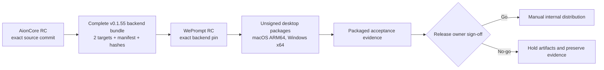

# Sprint 3 Internal Release Readiness Design

**Date:** 2026-08-15

**Status:** Approved for execution planning; this is not release authorization

**Release type:** Internal, unsigned, manually distributed

## 1. Decision Summary

Prepare Sprint 3 as a narrowly hardened internal release. Do not merge WePrompt `main` wholesale and do not remove Creative Studio code. Build from immutable reviewed baselines, repair and publish the AionCore backend contract first, then pin WePrompt to that exact backend release and produce two unsigned desktop artifacts.

The release is held until the release owner explicitly signs off after reviewing packaged-runtime evidence.

## 2. Scope

### In scope

- WePrompt Sprint 3 stabilization from `khoapnt-vng/WePrompt` commit `634f49c21567d9bd987b04887eaa0c6126b86353`.
- AionCore `v0.1.55` preparation from `khoapnt-vng/aioncore` commit `9bd693b3b43cdb1003061de0e4f62259ab6f42ae`.
- Selected release-critical fixes from later WePrompt work, ported only after source and behavior review.
- Unsigned internal packages for:
  - macOS ARM64
  - Windows x64
- Manual distribution with artifact hashes and installation instructions.
- Packaged acceptance covering migration safety, local authentication, chat streaming, MCP OAuth, OfficeCLI, presentation templates, restart behavior, Creative Studio exclusion, and disabled auto-update.

### Out of scope

- Public release, store submission, signing, notarization, or trusted-publisher setup.
- Auto-update feeds or automatic rollout.
- Creative Studio exposure, Studio provider calls, or integration of newer Studio branches.
- macOS x64, Linux, and Windows ARM64 packages.
- Wholesale integration of WePrompt `main`.
- Feature expansion unrelated to release blockers.
- Use of upstream `iOfficeAI/AionCore`; the backend must come from `khoapnt-vng/aioncore`.

## 3. Immutable Baselines and Branch Model

| Component | Repository | Starting ref | Immutable commit | RC branch |
|---|---|---|---|---|
| WePrompt | `khoapnt-vng/WePrompt` | `ghk/sprint3` | `634f49c21567d9bd987b04887eaa0c6126b86353` | `release/internal-sprint3` |
| AionCore | `khoapnt-vng/aioncore` | current `v0.1.54` line | `9bd693b3b43cdb1003061de0e4f62259ab6f42ae` | `release/internal-v0.1.55` |

Before work begins, refresh remote refs and record the exact branch heads, ancestry, tags, and working-tree state. Create isolated worktrees from the immutable commits. RC branches must reject force pushes and direct release changes; bounded task branches merge through reviewed pull requests with required checks.

No branch name is sufficient evidence. Every review, dependency pin, artifact manifest, and acceptance record must identify exact commits.

## 4. Release Architecture



The backend is independently releasable before WePrompt consumes it. WePrompt packaging must not download a mutable branch or infer backend contents. It consumes a versioned backend release unit whose source commit, checksums, and migration fingerprint are known in advance.

## 5. AionCore v0.1.55 Workstream

### 5.1 OAuth safety

The current backend can return and inject an expired access token when refresh is impossible or fails. The release must change this contract so that:

- Dynamically registered OAuth client identity is persisted with the token state or otherwise reliably recovered for refresh.
- Refresh uses the client identity associated with the issued token.
- An expired token without a valid refresh path produces an explicit reauthentication-required result.
- Refresh failure never falls back to injecting the expired token.
- Connection tests and actual agent tool calls use the same safe token contract.
- Automated tests cover valid token, successful refresh, missing refresh token, failed refresh, dynamic client identity, and reauthentication recovery.

### 5.2 Complete backend release unit

Each target bundle must contain:

```text
aioncore[.exe]
migration-lineage.json
managed-resources/
bundle-manifest.json
SHA256SUMS
```

`bundle-manifest.json` must include the repository, AionCore version, exact source commit, build target, build timestamp, migration-lineage fingerprint, and the path/hash of every bundled item. Migration lineage must be generated deterministically from the exact migration inputs used by the binary. Missing or mismatched members fail assembly.

### 5.3 Backend gates

The exact release candidate must pass:

- `cargo fmt --all -- --check`
- Clippy with warnings treated as failures for the release workspace
- Backend test suite, including new OAuth cases
- Migration immutability and deterministic-lineage validation
- Release build for both targets
- Bundle content and checksum validation after extraction
- Tag-to-commit and manifest-to-commit verification

The `v0.1.55` tag is created only from the accepted RC commit. Retagging or replacing release assets is prohibited; any correction produces a new version.

## 6. WePrompt Sprint 3 Workstream

### 6.1 Exact backend integration

Update the packaged AionCore contract to `khoapnt-vng/aioncore` `v0.1.55`, recording:

- Peeled tag commit
- Expected archive checksum per target
- Expected bundle manifest schema
- Expected migration-lineage fingerprint

Packaging must fail closed if any expected member, checksum, source commit, target, or lineage fingerprint differs.

### 6.2 Selected release-fix audit

Do not merge `main`. Review the following later fixes against Sprint 3 and port the smallest behaviorally complete change only when the issue is reproducible or the packaged acceptance contract requires it:

- Live WebSocket authentication
- Backend session cookie and headerless request handling
- OfficeCLI packaged-resource resolution
- Presentation-template packaging paths
- Windows source-build and packaging support

For each candidate, record its source commit, dependency assumptions, Sprint 3 applicability, tests, and the final decision: ported, already present, replaced, or excluded. macOS signing/notarization changes are excluded from this unsigned release unless a non-signing portion is independently necessary.

### 6.3 Creative Studio exclusion

Creative Studio remains in the source tree but is unavailable in this release:

- The production build must not set `AIONUI_ENABLE_CREATIVE_STUDIO=1`.
- A release-configuration assertion must fail if the Studio flag is enabled.
- Navigation, direct routes, runtime startup, provider/job calls, and Studio-specific storage creation must remain inaccessible in packaged builds.
- No newer Creative Studio branch is merged into the RC.
- Packaged smoke evidence must verify absence, not merely rely on the default flag value.

### 6.4 Auto-update exclusion

Auto-update must be disabled in the internal release configuration. Packaged acceptance must verify that the application does not contact or offer an upstream update feed. Manual replacement is the only supported update path for this release.

### 6.5 WePrompt source gates

The exact WePrompt RC must pass:

- Frozen dependency installation
- Type checking
- Linting
- Formatting checks
- i18n validation
- Deterministic Vitest gates plus controlled full-suite evidence under the flake policy below
- Release-configuration assertions for Studio and auto-update
- Exact backend-pin and backend-bundle contract tests
- Package-content verification for each target

A green Sprint 3 source workflow is useful baseline evidence but does not replace these RC and packaged-runtime gates.

### 6.6 Full-suite flake policy

The full Vitest suite is not a simple green/red release gate while BUG-046 remains open. The Sprint 3 baseline's declared intermittent set is frozen as follows:

| Register item | Known signature on the baseline | Release treatment |
|---|---|---|
| BUG-027 | `jobManager.test.ts`: `persists the remote identity before polling and uses the exact capped backoff schedule` and `stops repeated running snapshots at the thirty-minute lifecycle deadline` | Exact-signature triage is allowed; no timeout increase or broad quarantine |
| BUG-030 | `EnvironmentTeardownError` after green DOM tests in `TeamSiderSection.dom.test.tsx` | Process exit remains a failure and requires disposition |
| BUG-043 | `PresentationReadinessService`: `rejects same-byte replacement and hardlink drift of the inspection path` | Integrity-sensitive; never waivable by a later green run and subject to the Windows gate below |
| BUG-046 | `StudioPage.dom.test.tsx` `fitStoryboardToGoal` wait and `PresentationSourceGrantStore.test.ts` full-suite-position sightings | Exact-signature triage is allowed; new tests or signatures are not presumed flaky |

BUG-025 and BUG-046's `broker.test.ts` wall-clock case are fixed on the baseline and are not members of the release quarantine. A recurrence is a regression until investigated. The table can change only through a reviewed register update that names the exact test/signature, evidence, owner, and expiry condition.

For each exact RC commit and runner environment:

1. Run the full suite once and record the command, commit, runner, environment, start/end time, exit code, failed tests, logs, and machine-load evidence where available.
2. Treat every nonzero result as a gate event. Before any rerun, classify each failure as a confirmed regression, an exact known-flake signature, infrastructure failure, or unknown.
3. Confirmed regressions and unknown failures block the RC. An exact known-flake signature requires a focused diagnostic run, unchanged assertions, a linked register item, and reviewer disposition. Passing in isolation is diagnostic evidence, not proof that the full-suite failure is harmless.
4. Reruns are permitted only as recorded diagnostics with a stated question; they never replace or erase earlier results. Re-running until green is prohibited, and raising timeouts is not a flake disposition.
5. The source gate is satisfied only when deterministic tests pass, no failure remains unknown, every full-suite failure has a written disposition, and the evidence packet reports the total run count and the ordered outcome of every run.

## 7. Build and Artifact Matrix

| Platform | Architecture | Backend member | Desktop artifact | Signing state |
|---|---|---|---|---|
| macOS | ARM64 | `aioncore` | Internal installer/archive | Unsigned |
| Windows | x64 | `aioncore.exe` | Internal installer/archive | Unsigned |

Each desktop artifact must be traceable to the exact WePrompt RC commit and the exact AionCore bundle. Store the desktop artifact hash, embedded backend hash, build log, toolchain versions, and package inventory together. Unsigned-install bypass instructions must be explicit and must not weaken runtime security controls.

### 7.1 Windows risk gate

The targets do not have equal evidence. macOS has hosted source-suite history; Windows has no equivalent full-suite result, and BUG-043's readiness guard has never been exercised there. Windows therefore carries the higher release risk and must pass these entry gates before its packaged matrix can be accepted:

- A native Windows x64 CI job on the exact RC commit covering frozen install, source gates, tests under the §6.6 flake policy, and release build.
- The focused BUG-043 replacement and hardlink-drift suite on the shipped Windows filesystem/runtime, with the relevant path-stat and handle-stat evidence captured.
- A packaged-Electron readiness probe proving that missing, unsupported, or ambiguous identity evidence blocks approval rather than failing open.
- Windows package-content and bundled-AionCore verification after installation, not only archive inspection on macOS.

Run Windows packaged acceptance first. A missing Windows host, an unexercised BUG-043 guard, or a failed Windows-only gate is a Windows no-go; macOS results cannot waive it. Because both targets are in the approved scope, that holds the overall release unless the release owner explicitly re-scopes the release to macOS ARM64 only.

## 8. Packaged Acceptance

Run acceptance on clean, representative machines or VMs for every target. Source-mode results do not substitute for packaged execution.

### Required scenarios

1. Verify artifact checksum, documented unsigned-install flow, clean installation, and first launch.
2. Launch with a copy of the last accepted Sprint 2 database and verify successful migration without data loss.
3. Inject missing or mismatched migration lineage and verify startup fails before database mutation, with a recoverable diagnostic.
4. Verify local HTTP authentication and authenticated WebSocket/chat streaming.
5. Complete MCP OAuth login, connection test, and an actual authenticated tool call.
6. Exercise token expiry, successful refresh, failed refresh, and reauthentication recovery; confirm no expired token is sent.
7. Exercise packaged OfficeCLI discovery and preview.
8. Verify packaged presentation-template inventory and access paths.
9. Apply the BUG-017 disposition below. Do not claim runtime access-loss detection or recovery passed while its AionCore wire shape is unverified.
10. Quit cleanly, relaunch, and verify persisted sessions and data remain valid.
11. Verify Creative Studio is absent from navigation, inaccessible by direct route, and causes no Studio provider traffic or storage initialization.
12. Verify auto-update is disabled and no upstream update prompt or feed access occurs.

Collect application/backend logs, screenshots where useful, timestamps, artifact hashes, and tester results for every scenario. Acceptance failures must preserve the affected database and logs for diagnosis. Test fixtures must use copies; never use the only copy of user data.

### 8.1 BUG-017 known-issue disposition

BUG-017 is a P1 known issue, not an omitted test and not a passed acceptance scenario.

| Aspect | Release evidence and disposition |
|---|---|
| Proven | Access loss and `SQLITE_CANTOPEN` must not reach the corruption backup-and-rebuild path; the baseline contains revert-resistant unit coverage for this invariant |
| Unbuilt/unverified | Runtime classification, safe retry/restart UX, bounded diagnostics, and the exact AionCore runtime error wire shape |
| Operator workaround | Stop further activity, preserve and hash a database copy, collect bounded logs, restart/retry, and never delete, rebuild, or invoke corruption recovery without confirmed corruption and explicit consent |
| Required owner action | Name the WePrompt and AionCore owners, retain the wire-shape question as the first dependency, and decide whether to complete it before release or accept the availability/recovery limitation |
| Release disposition | The release cannot receive plain **Go** while this P1 remains open. It requires an explicit **Conditional go** accepting the unbuilt detection/recovery UX after reviewing the proven non-destructive safeguard; otherwise it is **No-go** |

Do not manufacture a synthetic runtime payload and call it acceptance evidence. If AionCore exposes an observed runtime wire shape before the release decision, add classification and recovery acceptance against that exact contract; otherwise retain the limitation and workaround verbatim in the internal release notes.

## 9. Evidence and Decision Gate

The release evidence packet must contain:

- Scope statement and explicit exclusions
- Exact WePrompt and AionCore base/head commits
- Pull request list and selected-fix audit
- CI results for both exact RC heads
- Full-suite run ledger with every attempt, ordered outcome, failure triage, focused diagnostics, and disposition
- Backend and desktop bundle manifests and SHA-256 hashes
- Toolchain and build-environment record
- Per-platform packaged acceptance matrix
- Known issues with severity, workaround, owner, and disposition
- Rollback/recovery instructions and preserved-data locations
- Draft internal installation instructions

The final decision record has three possible outcomes:

- **Go:** release owner explicitly approves the exact artifact hashes.
- **Conditional go:** permitted only for a documented non-security, non-data-integrity limitation with owner, workaround, and accepted risk. BUG-017 qualifies only while the non-destructive invariant remains proven and its residual risk is limited to availability and recovery UX; any data-integrity uncertainty is **No-go**.
- **No-go:** artifacts remain held; no distribution occurs.

Silence, elapsed time, partial platform success, or CI reruns do not constitute approval.

## 10. Stop Conditions and Invalidation Rules

Stop the release and return to the relevant gate if any of the following occurs:

- A migration-lineage failure mutates the database or cannot recover safely.
- An expired OAuth token is injected after refresh failure.
- Artifact content cannot be traced to the recorded source commits.
- Required bundle members or checksums are missing or inconsistent.
- Creative Studio or auto-update is enabled in a production package.
- Local authentication can be bypassed for HTTP or WebSocket traffic.
- Any target fails a required package or acceptance scenario.
- A full-suite failure is unknown, untriaged, or treated as erased by a later green run.
- Windows lacks native CI evidence or the BUG-043 guard is unexercised, ambiguous, or fails open there.
- BUG-017 access loss can invoke destructive recovery, or its open P1 disposition is omitted from the decision record.
- A release artifact is replaced without a new version and evidence cycle.

Any source change invalidates artifacts built from the prior commit. A backend pin, migration input, release configuration, packaging script, or build-toolchain change invalidates all affected package evidence. A platform-specific change invalidates at least that platform and any shared-gate evidence it touches.

## 11. Principal Risks and Controls

| Risk | Control |
|---|---|
| Sprint 3 and `main` have diverged | Narrow RC from immutable Sprint 3 commit; audited ports only |
| Backend release branch or assets drift | Exact commits, immutable tag, manifests, checksums, no asset replacement |
| Backend archive omits runtime contract files | Complete release unit plus extracted-content validation |
| OAuth refresh sends stale credentials | Correct client persistence, fail-closed token contract, end-to-end expiry tests |
| Unsigned packages confuse testers or trigger OS warnings | Internal-only scope, checksum verification, explicit per-OS install instructions |
| Hidden flag exposes Creative Studio | Build assertion plus packaged absence and traffic checks |
| Full-suite flakes hide regressions or encourage rerun-until-green | Frozen known-flake set, mandatory per-failure triage, recorded run ledger, no erasure by rerun |
| Windows behavior is inferred from macOS | Native Windows gates, BUG-043 filesystem/runtime evidence, Windows-first packaged acceptance |
| BUG-017 runtime data access is lost without recovery UX | Non-destructive invariant, explicit P1 conditional-go disposition, preservation-first operator workaround |
| Source tests create false confidence | Two-target packaged acceptance is mandatory |
| Dirty local checkout contaminates release work | Isolated worktrees, narrow staging, recorded commits, reproducible inventories |

## 12. Execution Order

1. Freeze and record exact repository baselines and create protected RC branches/worktrees.
2. Make AionCore `v0.1.55` independently releasable: OAuth safety, lineage generation, complete bundles, and green gates.
3. Publish immutable backend RC artifacts and verify them after extraction.
4. Pin WePrompt to the exact backend release and audit/port only approved release fixes.
5. Pass WePrompt source and packaging gates with Studio and auto-update assertions.
6. Build both unsigned desktop artifacts from one accepted WePrompt RC commit.
7. Run Windows risk gates first, then the full two-target packaged acceptance matrix and assemble the evidence packet.
8. Present exact artifact hashes and evidence to the release owner for explicit go/no-go sign-off.
9. On approval, distribute manually to the internal audience; otherwise hold all artifacts.

This sequence is intentionally fail-closed: incomplete evidence delays distribution, and no technical gate can substitute for the final human decision.
