# Excel Controlled-Change Workflow

> Problem statement, approved solution contract, and implementation plan  
> Date: 2026-08-05  
> Status: Approved design; implementation not started  
> Revised: 2026-08-05 — six corrections folded in after a review that probed OfficeCLI 1.0.143 directly. See *Review corrections* below.  
> Target: Sprint 2 follow-on work  
> Scope: `.xlsx` workbooks only in v1

## Executive summary

WePrompt can read Excel workbooks and its guarded artifact editor can safely change one cell value or formula. OfficeCLI can perform substantially richer workbook operations, but those capabilities are not yet exposed through one product-owned workflow with bounded inspection, a reviewable plan, deterministic execution, and fail-closed validation.

The proposed feature closes that gap. For any request to change an Excel workbook, WePrompt will inspect only the relevant workbook context, create a typed and reviewable change plan, obtain one approval for the complete plan, execute the approved operations on a versioned copy, validate the result, and deliver only a fully passing copy. The original workbook remains untouched.

The core rule is:

> The model may propose workbook changes. WePrompt owns the operation contract, scope validation, execution, verification, and delivery decision.

This is not a free-form “agent edits Excel” feature. It is a controlled-change system.

## Review corrections (2026-08-05)

Verified against OfficeCLI **1.0.143**'s own `--help` output and the repository at `origin/sprint2`.
All repository claims in this document (directory counts of 10 / 8 / 7 / 5, 12 locales, and every
named file path) were checked and hold. Six corrections were folded in:

| # | Correction | Where |
| --- | --- | --- |
| 1 | **Correctness hole.** Batch edits go to disk lazily through a live resident (deferred 2–10s), so hashing or publishing the staged workbook without an explicit confirmed flush could publish a file missing its final operations while every readback gate passed. Added a mandatory flush step. | 1.3, 7.1 step 12, Tasks 2 and 8 |
| 2 | **Misread mechanism.** Atomicity comes from `batch`'s **default** mode, not from `--stop-on-error`. ⚠ This item was itself partly wrong and is superseded by the round-2 table below — `--stop-on-error` is not inert, and `--force` is atomic. | 7.1 step 10, 7.2, Task 2 |
| 3 | **Gate gap.** `chart_cache_stale` is documented as opt-in and excluded from the default content bucket, so a workflow whose normal case is editing chart-referenced cells would never see it. Now queried by exact name. | 7.2, 8.1, Task 8 |
| 4 | **Escape hatch not closed by test.** OfficeCLI ships `raw`, `raw-set`, and `add-part`, and `batch`'s documented verb list is open-ended. The command union must deny them via a **runtime allowlist** (TypeScript types vanish at compile time), with a test. | 7.2, Task 2 |
| 5 | **Scope cut.** `fill-formula` removed from the v1 catalog: expanding a seed formula requires a partial Excel formula parser and reference translator, the largest risk in the catalog, for no capability gain over an explicit `set-formulas` matrix. | 4.1 |
| 6 | **Inconsistent limits.** `MAX_CHANGED_CELLS` (10,000) exceeded `MAX_TOTAL_CELLS` inspected (5,000), which would allow writing into never-read cells and weaken `expectedBefore`. Destructive operations are now bounded by the inspection budget; non-destructive bulk operations are not. | 5.2 |

Smaller items also folded in: `--cols`/`--limit` noted as sharper token controls, both accepted range
forms (`Sheet1!A1:C3` and `/Sheet1/A1:C3`) required to canonicalize with tests, run-report durability
made explicit, and the deliberate absence of `officecli load_skill xlsx` explained.

## Round-2 review corrections (2026-08-05)

A second review corrected **two of the round-1 corrections** and raised five blockers. Two round-1
items were wrong and are withdrawn:

| Round-1 item | What was wrong | Corrected position |
| --- | --- | --- |
| "`--stop-on-error` is semantically inert" | "Nothing is applied either way" describes **persistence**, not execution. The flag genuinely aborts remaining commands. `--force` is an alias for the **default** mode, which is atomic — it never causes partial persistence. | **Pass `--stop-on-error`** for crisp first-failure reporting. Ban **only `--best-effort`**. `--force` is permitted but pointless. |
| "Non-destructive bulk operations may exceed the inspection budget" | `format-range` overwrites existing formatting and `set-dimensions` overwrites prior widths — both destroy state. "Independent of cell values" is not "non-destructive". | **Every operation that overwrites state needs a local baseline for that state class.** The split is by *state class*, not by destructiveness. |

Blockers accepted and folded in:

| # | Blocker | Resolution |
| --- | --- | --- |
| R2-1 | **The model owned trusted evidence.** `ExcelChangePlanDraft` let the model supply `auditScope`, `expectedBefore` fingerprints, and `invariants` — a model-asserted fingerprint is not a measurement, so the entire precondition guarantee was circular. | Three-stage split: `ExcelPlanProposal` (model intent) → `PlanCompiler` (main process measures) → `FrozenExcelChangePlan` (trusted evidence + hashes). See 4.0. |
| R2-2 | **Token budget and safety inspection were conflated.** Local reads and fingerprints cost no model tokens; capping them with model limits starves the baseline that preconditions depend on. | Four separate limit families: `MODEL_EVIDENCE_*`, `LOCAL_BASELINE_*`, `LOCAL_DIFF_*`, `EXECUTION_*`. See 5.2. |
| R2-3 | **Report durability was left undecided**, and `originalUnchanged: true` is self-contradictory on `EXCEL_SOURCE_CHANGED`. | Durable JSON sidecar keyed by `planHash` + `outputHash`; screenshots may expire. `originalState` becomes a tri-state. |
| R2-4 | **Repository integration was incomplete** — no trigger or mount point, no defined `userRequest` source, a race with the existing private `withMutationLock`, an unspecified formula-dependency scanner, no OfficeCLI capability preflight, and status/cancel requests that cannot use the existing authorization shape. | New section 9.0, plus a dedicated task. |
| R2-5 | **Tasks 7–8 were too large**, and the proposed renderer test location already exceeds the ratchet. | Execution split into three vertical slices; renderer tests get a subdirectory. |

Additional finding from the same pass: `ExcelWorkflowContext` had the **renderer supply `workspace`**,
while the existing `callAuthorizedOfficeArtifact` helper *derives* workspace from the conversation
record. The plan now derives it too — the same "main owns trusted inputs" rule as R2-1.

## 1. Problem

### 1.1 Reading a workbook is not the same as changing it safely

An assistant can inspect cells and explain what a workbook contains. A trustworthy editing workflow must additionally answer all of these questions:

- What exact cells, formulas, structures, styles, and charts will change?
- Was the request interpreted within its intended scope?
- Did the user approve the complete set of changes?
- Is the workbook unchanged since that approval?
- Were only approved operations executed?
- Are formula references and workbook structures still valid?
- Did anything outside the approved scope change?
- Does the result reopen and render correctly?
- Can WePrompt prove what it checked instead of merely saying that the tool completed?

Without those controls, broad Excel edits can silently corrupt formulas, change unrelated sheets, flatten formatting, overwrite the source, or deliver a technically valid workbook with a poor rendered result.

### 1.2 Current product gap

The current safe Excel path is intentionally narrow:

- `OfficeArtifactEdit` supports `setCell` for Excel.
- `xlsxArtifactStrategy.ts` accepts an editable inspection only when exactly one cell is selected.
- `OfficeArtifactService` provides valuable safety machinery: workspace authorization, content hashes, staged files, conflict rejection, OpenXML validation, atomic installation, snapshots, and undo.
- The underlying OfficeCLI `1.0.143` supports richer typed operations, atomic batch execution, range reads, issue inspection, and cropped screenshots.

Those are two useful pieces, but there is no product-level bridge between them. Using raw OfficeCLI capability directly would bypass the review, scope, and verification contract that makes a broad workbook edit trustworthy.

### 1.3 Failure modes this feature must prevent

| Failure | Required prevention |
|---|---|
| The model invents values, formulas, or workbook structure | Ground the plan in inspected workbook facts and reject unsupported preconditions |
| A plan targets an unintended range or sheet | Parse targets into a closed range type and enforce a request-led audit boundary |
| The source changes after review | Bind approval to the source SHA-256 and reject stale plans |
| The renderer sends modified or extra operations | Keep the canonical approved plan in the main process; accept plan identity and authorization context, never an operation body |
| An operation partially succeeds | Apply each operation to a disposable staging copy; never publish a partial result |
| The tool reports success but the published bytes lag the in-memory edits | Flush the resident and confirm it before hashing or publishing the staged copy (see 7.1 step 12) |
| A formula or chart reference breaks | Run formula, named-range, table, chart, and issue gates before delivery |
| Unrelated workbook content changes | Compare before/after logical fingerprints and reject out-of-scope differences |
| The workbook opens but looks broken | Require render evidence and bounded visual-readiness checks for affected sheets |
| Completion overstates quality | Return exact gate results and never claim checks that did not run |

## 2. Approved product contract

The following decisions are fixed for v1.

| Decision | Contract |
|---|---|
| Interaction model | Review first |
| Approval | One approval for the complete immutable plan |
| Output | A collision-safe versioned `.xlsx` copy; never overwrite the original |
| Audit behavior | Request-led with a bounded audit around relevant dependencies and nearby patterns |
| Failure behavior | All or nothing; discard the staged result if any operation or required gate fails |
| Execution authority | A closed typed operation catalog; no raw shell, raw OOXML, or model-generated scripts |
| Model scope | Provider-agnostic; use the configured App Operations model |
| Replanning | Any plan, source, target, or operation change invalidates approval and requires a new plan |

### 2.1 Supported files

v1 supports standard `.xlsx` workbooks.

v1 rejects:

- `.xlsm` and any VBA or macro-bearing workbook;
- legacy `.xls` files;
- CSV and TSV files as editable workbooks;
- workbooks whose required changes depend on external data connections;
- password-protected, encrypted, or otherwise unreadable workbooks;
- any operation requiring arbitrary XML manipulation.

Unsupported files are not silently converted because conversion may discard workbook behavior.

### 2.2 Original and output semantics

- The source file is read-only for this workflow.
- Before execution, WePrompt re-hashes the source and compares it with the approved `source.contentHash`.
- Execution happens on an app-owned staging copy.
- During draft finalization, the main process sanitizes the proposed output name and resolves existing collisions with deterministic numeric suffixes: `report-reviewed.xlsx`, `report-reviewed-2.xlsx`, and so on. The resulting exact name appears on the review screen and is frozen by approval.
- At execution, WePrompt verifies that exact approved output path is still free. Final publication uses an exclusive filesystem operation, so a path created during the run also fails with `EXCEL_OUTPUT_CONFLICT`; WePrompt never overwrites it or silently selects another name.
- A successful result is installed beside the source at the exact approved output path.
- Before delivery, WePrompt verifies that the original source hash is still unchanged.
- On failure or cancellation, the staging copy and any output created by that run are removed. A pre-existing colliding file is never touched. No output workbook is delivered.

### 2.3 One-approval semantics

The review screen is the sole approval point. Approval freezes:

- the source content hash;
- the request summary;
- the audit scope;
- every finding, operation, target, precondition, dependency, and invariant;
- the output file name;
- the canonical plan hash.

The renderer approves with the required authorization context plus `{ planId, planHash }`. It never resubmits executable operations. The main process retrieves the frozen plan from its own registry and refuses missing, expired, hash-mismatched, conversation-mismatched, path-mismatched, or source-stale plans.

Plans expire after 30 minutes. Plans are intentionally ephemeral in v1; an application restart requires a new inspection and plan.

## 3. Solution architecture

```mermaid
flowchart LR
    A["Original .xlsx"] --> B["Read-only workbook inspector"]
    B --> C["Compact workbook profile"]
    C --> D["App Operations model"]
    D --> E["Typed plan draft"]
    E --> F["Main-process plan validator"]
    F --> G["Review UI"]
    G -->|"Approve planId + planHash"| H["Main-process plan registry"]
    H --> I["Versioned staging copy"]
    I --> J["Deterministic operation executor"]
    J --> K["Validation pipeline"]
    K -->|"All required gates pass"| L["Versioned workbook + run report"]
    K -->|"Any gate fails"| M["Discard staging copy"]
```



### 3.1 Component responsibilities

| Component | Responsibility | Must not do |
|---|---|---|
| Workbook Inspector | Read structure and bounded cell/range context; create compact facts and fingerprints | Mutate the workbook or send the full workbook automatically |
| Plan Generator | Convert the user request and inspected facts into a typed plan draft | Emit raw OfficeCLI commands, shell, scripts, or OOXML |
| Plan Validator | Parse ranges, enforce limits, verify operation schemas, preconditions, dependencies, and invariants | Repair an invalid plan by guessing |
| Plan Registry | Store the immutable canonical plan, source hash, plan hash, and expiry in main-process memory | Trust an executable plan returned by the renderer |
| Review UI | Explain findings and proposed changes; collect one approval or a revision request | Modify approved operations locally |
| Plan Executor | Topologically order approved operations, recheck preconditions, and invoke typed OfficeCLI adapters on staging | Change the original or expand scope |
| Validation Pipeline | Prove structural, semantic, formula, scope, render, and source-integrity outcomes | Treat `officecli validate` alone as quality proof |
| Delivery | Install a passing copy and present an evidence-based report | Deliver a partial, stale, or unvalidated file |

### 3.2 Process boundaries

- The main process owns filesystem access, workbook inspection, model task invocation, plan storage, OfficeCLI execution, and validation.
- Shared types and IPC request/response contracts live under `packages/desktop/src/common/`.
- The renderer owns only the review and progress experience. It receives declarative plan data and never accesses Node.js or OfficeCLI.
- All renderer-to-main requests pass through the existing IPC bridge and workspace authorization path.

## 4. Typed plan contract

### 4.0 Three-stage ownership: proposal → compiler → frozen plan

The original contract let the model return `Omit<ExcelChangePlan, 'planId' | 'source'>`, which included
`auditScope`, every operation's `expectedBefore` fingerprint, and the `invariants`. That is circular: a
precondition is only a guarantee if it was **measured**, and a model-asserted fingerprint is an opinion
about the workbook, not an observation of it. A model that misreads a sheet would emit a fingerprint
matching its own misreading, and the precondition check would pass.

The contract is therefore three stages with distinct ownership:

```text
ExcelPlanProposal        model-owned: intent only
   ↓                     - requested operations (kind + typed target + values)
   ↓                     - human-readable reason and risk per operation
   ↓                     - dependency edges between its own operation ids
   ↓                     - NO fingerprints, NO invariants, NO audit scope, NO hashes
PlanCompiler             main-process-owned: measurement
   ↓                     - derives auditScope from the proposal's targets + local dependency scan
   ↓                     - MEASURES expectedBefore for every target from the workbook
   ↓                     - DERIVES intendedAfter from the operation semantics, not from the model
   ↓                     - GENERATES the invariant set from operation classes and untouched sheets
   ↓                     - injects planId, source path, source.contentHash, outputFileName
   ↓                     - rejects any proposal whose targets it cannot measure
FrozenExcelChangePlan    trusted: what the user reviews and what execution obeys
                         - canonicalized, hashed, registry-stored, immutable
```

`ExcelChangePlan` as specified below is the **frozen** shape. `ExcelPlanProposal` is strictly smaller:
it carries `operations` reduced to `{ id, kind, typed payload, reason, risk, dependsOn }` and nothing
else. `ExcelChangePlanDraft` is deleted — its existence was the hole.

Consequences worth stating:

- **Findings are compiler output too**, not model output, wherever they assert workbook facts
  (duplicate rows, formula outliers). Section 5.3 already computes these locally; the model may
  *reference* a finding id but never invent one.
- The review screen shows **measured** before-state, so what the user approves is what the workbook
  actually contains — the whole point of one-approval semantics.
- A proposal referencing a range the compiler cannot measure is `EXCEL_PLAN_INVALID`, never a plan with
  an unverified precondition.

### 4.1 Frozen plan shape

The public shared contract belongs in `packages/desktop/src/common/types/office/excelChangePlan.ts`.

```ts
export type ExcelScalar = string | number | boolean | null;

export type ExcelRangeRef = {
  sheet: string;
  startCell: string;
  endCell: string;
};

export type ExcelChangePlan = {
  version: 1;
  planId: string;
  source: {
    fileName: string;
    contentHash: string;
  };
  requestSummary: string;
  auditScope: ExcelAuditScope;
  findings: ExcelAuditFinding[];
  operations: ExcelOperation[];
  invariants: ExcelInvariant[];
  outputFileName: string;
};

export type ExcelAuditScope = {
  requestedRanges: ExcelRangeRef[];
  dependencyRanges: ExcelRangeRef[];
  patternRanges: ExcelRangeRef[];
  includedSheets: string[];
  excludedSheets: string[];
};

export type ExcelAuditFinding = {
  id: string;
  category: 'data' | 'formula' | 'structure' | 'presentation';
  severity: 'info' | 'warning' | 'error';
  target: ExcelRangeRef | { sheet: string };
  summary: string;
  evidence: string[];
};

export type ExcelOperationBase = {
  id: string;
  category: 'data' | 'formula' | 'structure' | 'presentation';
  reason: string;
  risk: 'low' | 'medium' | 'high';
  dependsOn: string[];
  expectedBefore: ExcelExpectedBefore;
  intendedAfter: ExcelExpectedEffect;
};

export type ExcelExpectedBefore =
  | { kind: 'range'; target: ExcelRangeRef; fingerprint: string }
  | { kind: 'sheet'; sheet: string; fingerprint: string }
  | { kind: 'table'; sheet: string; name: string; fingerprint: string }
  | { kind: 'chart'; sheet: string; chartId: string; fingerprint: string }
  | {
      kind: 'absent';
      object: 'sheet' | 'table' | 'named-range' | 'chart';
      sheet?: string;
      name: string;
    };

export type ExcelExpectedEffect =
  | { kind: 'range-fingerprint'; target: ExcelRangeRef; fingerprint: string }
  | { kind: 'object-exists'; object: 'sheet' | 'table' | 'named-range' | 'chart'; sheet?: string; name: string }
  | { kind: 'object-absent'; object: 'sheet' | 'table' | 'named-range' | 'chart'; sheet?: string; name: string }
  | { kind: 'sheet-renamed'; from: string; to: string };

export type ExcelInvariant =
  | { kind: 'source-hash-equals'; hash: string }
  | { kind: 'range-equals'; target: ExcelRangeRef; fingerprint: string }
  | { kind: 'formula-issue-count-not-increased'; ranges: ExcelRangeRef[]; baseline: number }
  | { kind: 'reference-exists'; referenceType: 'sheet' | 'table' | 'named-range' | 'chart-series'; name: string }
  | { kind: 'sheet-fingerprint-equals'; sheet: string; fingerprint: string }
  | { kind: 'protected-object-equals'; objectId: string; fingerprint: string }
  | { kind: 'original-hash-equals'; hash: string };

/**
 * Model-owned intent. Deliberately cannot express evidence: no fingerprints, no
 * invariants, no audit scope, no hashes. The compiler measures all of those.
 */
export type ExcelPlanProposal = {
  version: 1;
  requestSummary: string;
  proposedOutputFileName: string;
  referencedFindingIds: string[];
  operations: Array<{
    id: string;
    kind: string;
    payload: unknown; // narrowed per-kind by the strict operation schema
    reason: string;
    risk: 'low' | 'medium' | 'high';
    dependsOn: string[];
  }>;
};

/** Trusted, canonicalized, hashed. Only the compiler produces one. */
export type FrozenExcelChangePlan = ExcelChangePlan;

export type ExcelPlanDraftResult = {
  plan: ExcelChangePlan;
  planHash: string;
  expiresAt: number;
};
```

`ExcelOperation` is a discriminated union. Each variant has only the properties required for that operation; it does not contain an OfficeCLI path or arbitrary property map.

The model returns `ExcelPlanProposal` — intent only. The **compiler** measures `expectedBefore`, derives
`intendedAfter` and `auditScope`, generates `invariants`, injects `planId`, the trusted source path and
`source.contentHash`, sanitizes the proposed output name, resolves its exact collision-free name before
review, canonicalizes and hashes the result, and returns `ExcelPlanDraftResult` to the renderer. The
model never supplies evidence of any kind (see 4.0).

The exact IPC requests are:

```ts
/**
 * The renderer supplies only the conversation and the file. `workspace` is DERIVED in
 * main from the conversation record — the existing `callAuthorizedOfficeArtifact` helper
 * already works this way, and accepting a renderer-supplied workspace would be a trusted
 * input coming from an untrusted side (the same defect as 4.0).
 */
export type ExcelWorkflowContext = {
  conversationId: string;
  filePath: string;
};

export type ExcelPlanDraftRequest = ExcelWorkflowContext & {
  operationId: string;
  userRequest: string;
  selectedRanges?: ExcelRangeRef[];
};

export type ExcelRunStartRequest = ExcelWorkflowContext & {
  planId: string;
  planHash: string;
};

export type ExcelRunStatusRequest = {
  conversationId: string;
  runId: string;
};

export type ExcelRunCancelRequest = ExcelRunStatusRequest;

export type ExcelRunPhase = 'queued' | 'executing' | 'validating' | 'delivered' | 'failed' | 'canceled';

export type ExcelWorkflowErrorCode =
  | 'EXCEL_PLAN_INVALID'
  | 'EXCEL_PLAN_EXPIRED'
  | 'EXCEL_PLAN_CONSUMED'
  | 'EXCEL_SOURCE_CHANGED'
  | 'EXCEL_OUTPUT_CONFLICT'
  | 'EXCEL_LIMIT_EXCEEDED'
  | 'EXCEL_PRECONDITION_FAILED'
  | 'EXCEL_POSTCONDITION_FAILED'
  | 'EXCEL_SCOPE_VIOLATION'
  | 'EXCEL_REFERENCE_FAILED'
  | 'EXCEL_INVARIANT_FAILED'
  | 'EXCEL_RENDER_FAILED'
  | 'EXCEL_CANCELED';

export type ExcelRunGateResult = {
  gate: 'source' | 'structure' | 'readback' | 'scope' | 'references' | 'invariants' | 'render';
  status: 'passed' | 'failed' | 'skipped' | 'not-mechanically-verifiable';
  evidence: string[];
};

export type ExcelRunReport = {
  sourceHash: string;
  outputPath: string;
  outputHash: string;
  originalState: 'verified-unchanged' | 'changed-externally' | 'not-verified';
  operationResults: Array<{ operationId: string; status: 'passed'; durationMs: number }>;
  gates: ExcelRunGateResult[];
  planning: {
    providerId?: string;
    modelId?: string;
    inputTokens?: number;
    outputTokens?: number;
  };
  durationMs: number;
};

export type ExcelRunStatus = {
  runId: string;
  phase: ExcelRunPhase;
  completedOperations: number;
  totalOperations: number;
  currentOperationId?: string;
  error?: {
    code: ExcelWorkflowErrorCode;
    operationId?: string;
    gate?: ExcelRunGateResult['gate'];
    evidence: string[];
    /**
     * Tri-state, because `originalUnchanged: true` is self-contradictory on
     * EXCEL_SOURCE_CHANGED — the failure IS that the original changed.
     */
    originalState: 'verified-unchanged' | 'changed-externally' | 'not-verified';
    outputDelivered: false;
  };
  report?: ExcelRunReport;
};
```

The main-process registries bind both plan and run IDs to their originating conversation, authorized workspace, and canonical file path. Status and cancellation requests cannot cross that binding.

### 4.1 Initial operation catalog

| Category | `kind` | Required typed payload |
|---|---|---|
| Data | `set-cells` | Rectangular `target` and equally sized `ExcelScalar[][]` |
| Data | `clear-range` | Rectangular `target` and clear mode `contents` or `contents-and-format` |
| Data | `delete-duplicate-rows` | Bounded target, header flag, key-column names, exact duplicate row fingerprints |
| Data | `sort-range` | Bounded target, header flag, ordered sort keys with column and direction |
| Formula | `set-formulas` | Rectangular target and equally sized formula matrix without leading `=` ambiguity |
| Formula | `set-named-range` | Valid workbook-level name and parsed target range |
| Structure | `add-sheet` | New sheet name and insertion position |
| Structure | `rename-sheet` | Existing name and new name |
| Structure | `insert-rows` | Sheet, one-based start row, and count |
| Structure | `delete-rows` | Sheet, one-based start row, count, and row fingerprints |
| Structure | `insert-columns` | Sheet, one-based start column, and count |
| Structure | `delete-columns` | Sheet, one-based start column, count, and column fingerprints |
| Structure | `create-table` | Name, source range, header flag, and allowlisted table style |
| Structure | `resize-table` | Existing table name and new parsed range |
| Presentation | `format-range` | Target and allowlisted partial format object |
| Presentation | `set-dimensions` | Typed row heights and/or column widths with numeric bounds |
| Presentation | `freeze-panes` | Sheet plus frozen row and column counts |
| Presentation | `set-conditional-format` | Target and a discriminated allowlisted rule |
| Presentation | `upsert-chart` | Chart identifier, type, title, source ranges, and anchor range |

The validator rejects unknown operation kinds and unknown fields. “Normalize types” and similar user-facing intentions compile into exact `set-cells` operations; the executor never performs an open-ended normalization pass.

**`fill-formula` is deliberately excluded from v1.** Expanding a seed formula across a range means
writing a partial Excel formula parser and reference translator — preserving absolute and mixed A1
references, rejecting external links, 3D references, and R1C1 grammars — which is the largest and
most error-prone component in the catalog and does not fit inside a single validator bullet. v1
requires the planner to emit an explicit `set-formulas` matrix instead: it already knows the target
range, so enumeration costs nothing and every produced formula is reviewable, fingerprinted, and
readback-verified like any other cell write. A `fill-formula` operation may be added later as its own
task with its own parser test matrix; until then, execution never asks OfficeCLI or the model to
improvise formula translation.

### 4.2 Format allowlist

`format-range` supports only:

- font family, size, bold, italic, underline, and semantic color;
- fill color;
- horizontal and vertical alignment;
- number format;
- wrap text;
- borders with allowlisted side, line style, and semantic color.

Numeric sizes and widths are clamped by validation constants. Raw OOXML names, relationship IDs, formulas embedded in style fields, and unknown OfficeCLI properties are invalid.

### 4.3 Preconditions and invariants

Every destructive or structure-changing operation carries an exact `expectedBefore` snapshot. Depending on the operation, it contains canonical cell values/formulas, row or column fingerprints, a table definition, a chart definition, or a sheet-structure fingerprint.

The initial invariant catalog is:

- `source-hash-equals`: the source still matches the reviewed version;
- `range-equals`: specified cells or formulas equal expected postconditions;
- `formula-issue-count-not-increased`: no new formula issue exists in the audit boundary;
- `reference-exists`: named range, table, chart source, and referenced sheet remain resolvable;
- `sheet-fingerprint-equals`: excluded or untouched sheets remain logically equivalent;
- `protected-object-equals`: protected sheets, ranges, and objects remain unchanged;
- `original-hash-equals`: the original file is unchanged at delivery time.

## 5. Request-led bounded audit

WePrompt must not automatically read the entire workbook into the model context.

### 5.1 Audit boundary

The inspector includes:

1. sheets and ranges explicitly named by the user;
2. the active or selected range when the request is made from the workbook preview;
3. immediate upstream and downstream formula dependencies of those ranges;
4. tables, charts, validations, and named ranges that reference those areas;
5. nearby rows or columns required to infer an existing formula or formatting pattern.

The inspector excludes unrelated sheets and does not perform an unsolicited workbook redesign. If the request truly requires a whole-workbook change, the review must explicitly say so and list every included sheet.

### 5.2 Token controls

Use small inspection primitives rather than one workbook dump:

- `inspect_workbook`: sheet names, used ranges, tables, charts, validations, named ranges, protection, and issue counts;
- `read_sheet_range`: values, formulas, and compact format signatures for a bounded range, backed by
  `view <file> text --range` (plus `--cols` and `--limit` when they narrow output further). Note that
  OfficeCLI accepts **both** `Sheet1!A1:C3` and `/Sheet1/A1:C3` range forms — the parser canonicalizes
  to one internal representation and tests must cover both, since a planner may emit either;
- `inspect_dependencies`: immediate formula and object references for a bounded range;
- `render_sheet_region`: cropped image evidence only when a proposed operation can change presentation or a chart.

Initial hard limits:

```ts
const EXCEL_PLAN_MAX_OPERATIONS = 100;
const EXCEL_PLAN_MAX_FINDINGS = 50;
const EXCEL_PLAN_MAX_CHANGED_CELLS = 10_000;
const EXCEL_USER_REQUEST_MAX_CHARS = 16_000;
const EXCEL_INSPECTION_MAX_CELLS_PER_READ = 500;
const EXCEL_INSPECTION_MAX_TOTAL_CELLS = 5_000;
const EXCEL_INSPECTION_MAX_SHEETS = 20;
const EXCEL_RENDER_MAX_REGIONS = 10;
const EXCEL_PLAN_MAX_PROMPT_CHARS = 80_000;
const EXCEL_PLAN_MAX_OUTPUT_TOKENS = 12_000;
const EXCEL_PLAN_TTL_MS = 30 * 60 * 1_000;
const EXCEL_RUN_RESULT_TTL_MS = 60 * 60 * 1_000;
```

Requests exceeding a hard limit return `EXCEL_LIMIT_EXCEEDED` with the limiting dimension. They do not silently truncate executable scope. The user may narrow the request and generate a new plan.

**Four limit families, because token cost and safety coverage are different problems.** Reading and
fingerprinting cells locally costs no model tokens; capping local measurement with a model-token budget
starves the baseline that every precondition depends on. Only what is *sent to the model* needs
aggressive capping.

| Family | Governs | Sizing principle |
| --- | --- | --- |
| `MODEL_EVIDENCE_*` | compact profile, sampled cells, and prompt/output caps sent to the planner | Aggressively small — this is the only token-priced path |
| `LOCAL_BASELINE_*` | cells, styles, structures, and objects measured to build `expectedBefore` | Must cover **every** state the plan overwrites; generous, bounded by wall-clock and memory, not tokens |
| `LOCAL_DIFF_*` | before/after manifest comparison for the scope gate | Must cover the whole workbook, since the gate proves nothing changed *outside* scope |
| `EXECUTION_*` | operation count, changed cells, formula cells, run duration | Product-safety ceilings on blast radius |

**Every operation that overwrites state requires a local baseline for the state class it overwrites.**
The split is by state class, not by a destructive/non-destructive distinction — `format-range` destroys
prior formatting and `set-dimensions` destroys prior widths just as surely as `set-cells` destroys prior
values. Concretely:

| Operation class | Baseline the compiler must measure |
| --- | --- |
| value/formula writes, clears, sorts, dedupe, row/column deletes | canonical cell values and formulas for the target, plus row/column fingerprints |
| formatting, dimensions, conditional formats, freeze panes | style/dimension signature for the target region |
| sheet, table, named-range, chart operations | the object definition being replaced or removed |

No operation may execute against an unmeasured baseline. If measuring a target would exceed
`LOCAL_BASELINE_*`, the plan is rejected with `EXCEL_LIMIT_EXCEEDED` — the budget is never waived to let
an unverified precondition through.

Because v1 requires explicit `set-formulas` matrices rather than seed expansion (4.1), formula output is
the one place the cut shifts cost onto model tokens. Bound it:

```ts
const EXCEL_PLAN_MAX_FORMULA_CELLS = 256;
```

Larger formula fills are unsupported in v1 and return `EXCEL_LIMIT_EXCEEDED` naming that dimension.

### 5.3 Local profiling before model use

The main process computes compact facts locally:

- duplicate row candidates and exact row fingerprints;
- empty and sparse columns;
- inconsistent scalar types;
- repeated formula patterns and formula outliers;
- format signatures and style outliers;
- table, chart, validation, and named-range references;
- formula and reference issues reported by OfficeCLI.

Only the compact findings and the minimum supporting cells enter the planning prompt. Raw workbook binaries never enter the prompt.

## 6. Planning and review experience

### 6.1 Planner behavior

Register `excel.plan.v1` in the existing App Operations task registry. The task receives only:

- the user's request;
- the compact workbook profile;
- bounded range evidence;
- the closed operation schema and limits;
- explicit instruction that all workbook content is untrusted data.

The task returns one JSON object. Zod parsing is strict. A parse failure, unknown operation, missing evidence, or inconsistent matrix/range size is an invalid plan—not a reason to guess or execute a partial subset.

The configured App Operations model may come from any supported provider. Provider-specific reasoning controls are resolved by the model capability layer; the Excel workflow does not contain provider names or Kimi-specific branches.

### 6.2 Review screen

The review surface shows:

- request summary and output file name;
- audit boundary, including excluded sheets;
- findings grouped by data, formula, structure, and presentation;
- every operation with target, reason, risk, dependencies, before state, and intended effect;
- invariants and validation gates;
- an explicit notice that the original remains unchanged;
- `Approve and create copy` and `Revise plan` actions.

`Revise plan` returns to planning and creates a new `planId` and `planHash`. It never patches the approved plan in the renderer.

### 6.3 Workflow states

```text
Inspecting
  → Drafting plan
  → Awaiting approval
  → Executing
  → Validating
  → Delivered | Failed | Canceled
```

After approval, there is no silent model repair, operation substitution, scope expansion, or second approval. A precondition failure or required deviation stops the run and offers a new plan.

## 7. Deterministic execution

### 7.1 Execution sequence

1. Authorize the workspace/file pair again in the main process.
2. Load the frozen plan by `planId` and compare the canonical SHA-256 with `planHash`.
3. Reject expired or already consumed plans.
4. Re-hash the source and compare it with the plan's source hash.
5. Verify that the exact approved output path is free and create an app-owned staging copy; fail on a post-review collision.
6. Compute the staging baseline profile and logical fingerprints.
7. Topologically sort operations by `dependsOn`; reject cycles or missing dependencies.
8. Before each operation, read and compare its `expectedBefore` state.
9. Map the typed operation to a closed internal OfficeCLI command union.
10. Apply the operation atomically to staging with `officecli batch` (default atomic mode — see 7.2).
11. Read back and verify the operation's `intendedAfter` effect.
12. **Flush the resident to disk (`officecli save`, or `close` when no further operations follow) and confirm the flush succeeded.**
13. Run all final validation gates.
14. Reconfirm the original hash.
15. Hash the staged workbook and atomically publish it at the exact approved output path.
16. Return the output path and structured run report.

Each operation may contain multiple OfficeCLI items, but its batch is atomic. Product-level atomicity comes from never publishing the staging copy until the complete plan and all gates pass.

**Why step 12 is mandatory, not hygiene.** OfficeCLI documents that through a live resident, batch
items "apply in memory and the disk write is **deferred** to save/close/idle-autosave — adaptive
2-10s after going idle," and that `save`/`close` is "needed before a non-officecli program reads the
file." Step 11's readback is safe because officecli's own reads always see pending edits — but
hashing the staged file and publishing it are **non-officecli reads**. Without an explicit flush,
this workflow can compute `outputHash` over, and publish, a workbook missing its final operations
while every readback gate reported success. To remove the timing variable entirely, run this
workflow's officecli invocations with `OFFICECLI_RESIDENT_FLUSH=each`; the flush step remains
required regardless, and a test must assert that publication is impossible before a confirmed flush.

### 7.2 Safe OfficeCLI boundary

Extend `OfficeCliRunner` with typed methods for:

- `query` and bounded `viewTextRange` inspection (`view <file> text --range`, with `--cols` and
  `--limit`/`--max-lines` where they narrow output further);
- `viewIssues`, including the **opt-in** `chart_cache_stale` type (see 8.1);
- `batch` using JSON on stdin, never shell interpolation;
- `screenshot` with a parsed sheet/range target;
- existing `validate`, `save`, and `close` lifecycle calls.

**Batch atomicity comes from the default mode, not from a flag.** OfficeCLI documents
`--best-effort` as "pre-atomic legacy semantics. Default: any failure rolls back the whole batch." The
"nothing is applied either way" note about `--stop-on-error` describes **persistence**, not execution:
without it the batch runs every remaining command and then rolls back; with it the batch aborts at the
first failure. Both end with nothing persisted. Therefore:

- **Never pass `--best-effort`.** It is the **only** flag that can produce a partially applied batch, and
  it is therefore the single thing standing between this design and silent partial mutation.
- **Do pass `--stop-on-error`.** It does not affect persistence in the default atomic mode, but it aborts
  the remaining commands instead of executing them all and then rolling back — which gives a crisp
  first-failure diagnosis and avoids pointless work. It is not the atomicity mechanism; it is a
  reporting and efficiency choice.
- `--force` is permitted but pointless: it is an alias for the default continue-on-error mode, which is
  still atomic. Prefer omitting it.

A test must assert the exact argv **never contains `--best-effort`**, so a later "optimization" cannot
silently reintroduce partial application.

**The batch verb allowlist must be enforced at runtime, not by types.** OfficeCLI ships `raw`,
`raw-set` ("universal fallback for any OpenXML operation"), and `add-part`, and documents `batch` as
accepting "the bare verb (add/set/remove/move/swap/get/query/…)" — an open list. A TypeScript union is
erased at compile time and proves nothing about the JSON actually written to stdin, so the runner must
check every batch item's verb against an **explicit runtime allowlist** immediately before serialization
and throw on anything outside it. A test must prove a constructed batch containing `raw`, `raw-set`, or
`add-part` is rejected before the child process is spawned.

Long-running runner methods accept an `AbortSignal`. Cancellation terminates the child process, closes any resident, and lets the workflow discard staging; it never publishes the partially changed staging copy.

The model must not provide OfficeCLI paths or property maps. The operation registry constructs both from parsed `ExcelRangeRef` values and allowlisted typed properties. `execFile`/`spawn` remains `shell: false`.

**Why this workflow does not run `officecli load_skill xlsx`.** The Template Gallery directives require
`load_skill` because there the model itself composes OfficeCLI invocations and needs the tool's own
authoring rules. Here the model never emits a command: it returns a typed plan, and the registry
constructs every invocation. Loading the skill would add prompt weight and, worse, teach the planner a
command vocabulary it must not use. The omission is deliberate, not an oversight.

## 8. Validation and delivery

### 8.1 Required gates

| Gate | Evidence | Failure behavior |
|---|---|---|
| Source integrity | Source SHA-256 before execution and before delivery | Reject as `EXCEL_SOURCE_CHANGED` |
| Structural validity | `officecli validate --json`, close, and reopen/read | Reject as `INVALID_OFFICE_ARTIFACT` |
| Operation readback | Exact postcondition after every operation | Reject as `EXCEL_POSTCONDITION_FAILED` |
| Diff scope | Canonical before/after workbook manifest and approved target set | Reject as `EXCEL_SCOPE_VIOLATION` |
| Formula/reference health | OfficeCLI issues plus resolvable formulas, names, tables, and chart series — **including the opt-in `chart_cache_stale` type** | Reject as `EXCEL_REFERENCE_FAILED` |
| Invariants | Every plan invariant evaluated with recorded evidence | Reject as `EXCEL_INVARIANT_FAILED` |
| Render readiness | Required changed regions render; no visible `#####`; chart render/source checks pass | Reject as `EXCEL_RENDER_FAILED` |
| Original preservation | Original SHA-256 still equals approved source hash | Reject as `EXCEL_SOURCE_CHANGED` |

### 8.2 Visual assurance boundary

v1 mechanically gates facts it can prove:

- changed regions can be rendered to PNG;
- rendered values do not contain `#####`;
- row heights and column widths are within safe numeric bounds;
- chart anchors, sources, series, and referenced sheets exist;
- screenshots are retained as run evidence until the run report is delivered.

Subjective aesthetics are not a mechanical hard gate. If a provider-independent deterministic check for clipping or legibility is unavailable, the report must say `not mechanically verified`; it must not claim “visual QA passed.” A later bounded rendered-QA model audit may add stronger judgment, but it is not required to ship this controlled v1 and must not introduce silent repairs after approval.

### 8.3 Run report

On success, the UI reports:

- output workbook path and version hash;
- source hash and confirmation that the original is unchanged;
- approved operation count and exact operation results;
- gates run, status, duration, and evidence references;
- skipped non-required checks with reasons;
- App Operations provider/model metadata and token usage for planning;
- total execution and validation duration.

On failure, the UI reports the failed operation or gate, leaves the original untouched, confirms that no output was delivered, and offers `Create revised plan`.

## 9.0 Repository integration prerequisites

The original document specified components but not how they attach to the running product. Each item
below is a real gap, verified against `origin/sprint2`, and must be resolved in Task 0 (below) before
component work begins.

| Gap | Resolution required |
| --- | --- |
| **No workflow trigger or mount point.** The document never says how a user starts this. | Define the entry point explicitly: which control in `PreviewPanel.tsx` / the Excel viewer surfaces "Request changes", and where `ExcelChangeWorkflow` mounts relative to the existing `ArtifactEditor`. |
| **No defined source for `userRequest`.** The planner needs the user's words, but nothing says where they come from. | Decide: a dedicated input in the workflow panel, or the chat message that triggered it. If chat-sourced, define how the workflow receives it without re-reading conversation state at execution time. |
| **Race with the existing single-cell editor.** Verified: `OfficeArtifactService.ts:202` serializes mutations through a **private** `withMutationLock(artifact.filePath, …)`. A workflow run that publishes while a `setCell` apply is in flight on the same file races it. | The workflow must acquire the *same* per-file lock. Either expose it on the service or route publication through a service method that already holds it. A test must prove concurrent single-cell apply and workflow publish cannot interleave. |
| **Formula dependency discovery is unspecified.** §5.1 requires "immediate upstream and downstream formula dependencies", which needs a formula reference scanner the plan never scopes. | Scope it as its own task with its own tests, or reduce v1's audit boundary to explicitly-named plus selected ranges only and state that dependency expansion is deferred. Do not leave it implied. |
| **No OfficeCLI capability preflight.** The workflow depends on `batch` default-atomic semantics, `view issues --type`, and `screenshot --range`, none of which are guaranteed by an arbitrary installed version. | Preflight the binary version and required capabilities before the first draft; fail with a typed unsupported-tool result rather than mid-run. |
| **Status/cancel cannot use the existing authorization shape.** `callAuthorizedOfficeArtifact` is generic over `OfficeArtifactRequestBase` and resolves workspace from the conversation; `{ conversationId, runId }` does not fit it. | Add an explicit run-scoped authorization path that checks the run registry's conversation binding, rather than bending the artifact-request helper. |

## 9. Repository placement

The implementation must preserve the repository's ten-child directory limit.

### 9.1 Shared contracts

- Add `packages/desktop/src/common/types/office/excelChangePlan.ts`.
- Extend `packages/desktop/src/common/types/office/artifactEditor.ts` only for shared error/result and IPC-facing workflow types that belong to the artifact editor.
- Extend `packages/desktop/src/common/adapter/ipcBridge.ts`.
- Extend `packages/desktop/src/common/adapter/native/payloadSchemas.ts` with strict schemas.

### 9.2 Main process

`packages/desktop/src/process/services/office-artifact/` already has ten direct children. Move `xlsxArtifactStrategy.ts` into a new `excel/` subdirectory and add the subdirectory in the same change, leaving the root count unchanged.

Proposed `excel/` contents:

```text
excel/
├── ExcelChangeWorkflowService.ts
├── index.ts
├── operationRegistry.ts
├── planRegistry.ts
├── planValidator.ts
├── validationPipeline.ts
├── workbookDiff.ts
├── workbookInspector.ts
└── xlsxArtifactStrategy.ts
```

Also modify:

- `packages/desktop/src/process/services/office-artifact/OfficeArtifactService.ts` to compose or delegate to the workflow service without weakening the existing single-cell path;
- `packages/desktop/src/process/services/office-artifact/officeCliRunner.ts` for typed query, batch, issue, and screenshot adapters;
- `packages/desktop/src/process/services/office-artifact/index.ts` for exports and singleton wiring;
- `packages/desktop/src/process/services/appOperations/excelPlanTask.ts` as the one new planner task;
- `packages/desktop/src/process/services/appOperations/index.ts` to register and expose `excel.plan.v1`;
- `packages/desktop/src/process/bridge/applicationBridge.ts` for authorized workflow providers.

### 9.3 Renderer

Add one child feature directory so the existing ArtifactEditor directory remains under its limit:

```text
packages/desktop/src/renderer/pages/conversation/Preview/components/ArtifactEditor/ExcelChangeWorkflow/
├── ExcelChangeWorkflow.module.css
├── ExcelPlanOperationList.tsx
├── ExcelPlanReview.tsx
├── ExcelRunStatus.tsx
├── index.tsx
└── useExcelChangeWorkflow.ts
```

Use Arco components, `@icon-park/react`, semantic tokens, strict TypeScript, and translated user-facing text.

### 9.4 Tests

The OfficeArtifact unit-test directory already has eight files. Create `tests/unit/process/services/officeArtifact/excel/`, move `xlsxArtifactStrategy.test.ts` into it, and place new Excel workflow tests there. This keeps both directory levels within the limit.

**Renderer tests need a subdirectory too.** Verified: `tests/unit/previews/artifact-editor/` already
holds **11 files** — over the ten-child limit before this feature adds anything. Excel workflow renderer
tests therefore go in `tests/unit/previews/artifact-editor/excel/`; adding a file to the parent would
worsen an existing violation, which the ratchet rule forbids.

## 10. Implementation plan

### Global implementation constraints

- Implement from a fresh branch/worktree based on the current `origin/sprint2` head; do not layer runtime work onto the dirty planning checkout.
- Read `CONTRIBUTING.md`, `ONBOARDING.md`, and the repository architecture, i18n, and testing skills before editing.
- Preserve current single-cell Excel editing, DOCX editing, preview leases, snapshots, and undo behavior.
- Do not add a raw-command escape hatch.
- Do not add package, release, installer, or deployment work to this scope.
- Use test-driven increments: add the focused failing test, implement the minimum contract, run the focused test, then run the relevant broader gates.
- Use Conventional Commits if the implementation is committed; do not push unless explicitly asked.

### Task 0 — Close the integration prerequisites (must precede component work)

**Files:** documentation-only decisions recorded in this plan, plus a preflight module if the capability
check lands here.

**Steps**

- [ ] Decide and record the workflow trigger and mount point (which control, which parent component).
- [ ] Decide and record where `userRequest` comes from, and how it reaches the compiler.
- [ ] Decide how the workflow participates in `OfficeArtifactService`'s per-file `withMutationLock`, and record the chosen seam.
- [ ] Decide the v1 audit boundary: implement a formula dependency scanner as its own task, or restrict v1 to named plus selected ranges and state the deferral.
- [ ] Implement or specify the OfficeCLI version/capability preflight (`batch` default-atomic, `view issues --type`, `screenshot --range`) with a typed unsupported-tool failure.
- [ ] Specify the run-scoped authorization path for status/cancel, distinct from `callAuthorizedOfficeArtifact`.

**Acceptance**

- No later task depends on an undecided integration point.
- A wrong or missing OfficeCLI capability fails before planning, never mid-run.

### Task 1 — Define the shared plan and workflow contracts

**Files**

- Create `packages/desktop/src/common/types/office/excelChangePlan.ts`.
- Modify `packages/desktop/src/common/types/office/artifactEditor.ts`.
- Modify `packages/desktop/src/common/adapter/native/payloadSchemas.ts`.
- Modify `tests/unit/process/bridge/nativePayloadSchemas.test.ts`.

**Steps**

- [ ] Add strict shared types for ranges, findings, the complete operation union, invariants, plan hashes, draft results, run states, reports, and error codes.
- [ ] Add constants for limits and the 30-minute plan TTL.
- [ ] Add strict Zod schemas for draft, execute, status, and cancel requests.
- [ ] Reject unknown keys, malformed A1 references, non-`.xlsx` inputs, unsafe file names, over-limit arrays, non-rectangular matrices, and raw command/property fields.
- [ ] Add native-schema tests proving valid payloads pass and renderer-supplied operations, paths outside the request shape, unknown fields, and excessive arrays fail.

**Focused verification**

```bash
bun run test tests/unit/process/bridge/nativePayloadSchemas.test.ts
bunx tsc --noEmit
```

**Acceptance**

- The public plan cannot represent shell, arbitrary OfficeCLI commands, or raw OOXML.
- Every IPC request is bounded before it reaches workflow code.

### Task 2 — Reorganize the Excel service and harden the OfficeCLI adapter

**Files**

- Move `packages/desktop/src/process/services/office-artifact/xlsxArtifactStrategy.ts` to `packages/desktop/src/process/services/office-artifact/excel/xlsxArtifactStrategy.ts`.
- Move `tests/unit/process/services/officeArtifact/xlsxArtifactStrategy.test.ts` to `tests/unit/process/services/officeArtifact/excel/xlsxArtifactStrategy.test.ts`.
- Create `packages/desktop/src/process/services/office-artifact/excel/index.ts`.
- Modify `packages/desktop/src/process/services/office-artifact/OfficeArtifactService.ts` imports.
- Modify `packages/desktop/src/process/services/office-artifact/officeCliRunner.ts`.
- Modify `tests/unit/process/services/officeArtifact/officeCliRunner.test.ts`.

**Steps**

- [ ] Move the existing strategy and test without behavioral changes; run the existing single-cell tests before adding workflow code.
- [ ] Add closed internal `OfficeCliBatchCommand` types.
- [ ] Add `query`, `viewTextRange`, `viewIssues`, `batch`, and `screenshot` runner methods.
- [ ] Implement `batch` with JSON over stdin and `shell: false`, relying on OfficeCLI's **default atomic mode**, passing `--stop-on-error` for first-failure reporting and **never** `--best-effort` (see 7.2; `--force` is permitted but pointless).
- [ ] Deny `raw`, `raw-set`, and `add-part` in the internal batch command union.
- [ ] Add a `save`/`close` flush method whose success is observable, so execution can prove a flush happened before hashing or publishing.
- [ ] Thread an `AbortSignal` through long-running batch, query, issue, and screenshot calls and terminate child processes on cancellation.
- [ ] Constrain screenshot input to a parsed sheet/range and output to app-owned scratch space.
- [ ] Add tests asserting exact argv, stdin serialization, timeout/error mapping, and rejection of missing output.
- [ ] Add tests asserting argv **never contains `--best-effort`**, and that a batch containing `raw`, `raw-set`, or `add-part` is rejected by a **runtime allowlist** (not only by TypeScript typing, which vanishes at compile time) before execution.
- [ ] Add tests asserting both `Sheet1!A1:C3` and `/Sheet1/A1:C3` range forms canonicalize to one internal representation.

**Focused verification**

```bash
bun run test tests/unit/process/services/officeArtifact/officeCliRunner.test.ts
bun run test tests/unit/process/services/officeArtifact/excel/xlsxArtifactStrategy.test.ts
```

**Acceptance**

- The existing one-cell editor behaves identically after the move.
- No batch method accepts a raw CLI string, and no raw-XML verb can reach a batch.
- Partial-application flags cannot appear in argv.

### Task 3 — Build the bounded workbook inspector and logical fingerprints

**Files**

- Create `packages/desktop/src/process/services/office-artifact/excel/workbookInspector.ts`.
- Create `packages/desktop/src/process/services/office-artifact/excel/workbookDiff.ts`.
- Create `tests/unit/process/services/officeArtifact/excel/workbookInspector.test.ts`.
- Create `tests/unit/process/services/officeArtifact/excel/workbookDiff.test.ts`.

**Steps**

- [ ] Parse and canonicalize A1 sheet/range references, including quoted sheet names, without forwarding model text as CLI paths.
- [ ] Inspect workbook metadata, used ranges, protection, tables, charts, validations, names, and issue counts.
- [ ] Read only requested, selected, dependency, and pattern ranges within the hard limits.
- [ ] Compute local duplicate, type, formula-pattern, sparse-column, and format-signature findings.
- [ ] Generate stable per-sheet and protected-object logical fingerprints.
- [ ] Generate a deterministic compact profile with a hard prompt-character check; fail instead of truncating executable evidence.
- [ ] Add tests for sparse workbooks, quoted sheet names, formulas, tables/charts, protected content, dependency expansion, limit failures, and stable fingerprint order.

**Focused verification**

```bash
bun run test tests/unit/process/services/officeArtifact/excel/workbookInspector.test.ts
bun run test tests/unit/process/services/officeArtifact/excel/workbookDiff.test.ts
```

**Acceptance**

- Unrelated sheets do not enter the model profile for a bounded request.
- Reordering query results does not change a logical fingerprint.

### Task 4 — Add the provider-agnostic Excel planning task

**Files**

- Create `packages/desktop/src/process/services/appOperations/excelPlanTask.ts`.
- Modify `packages/desktop/src/process/services/appOperations/index.ts`.
- Create `tests/unit/process/appOperations/excelPlanTask.test.ts`.
- Modify `packages/desktop/src/renderer/components/settings/SettingsModal/AppOperationsModelCard.tsx`.
- Modify all 12 `packages/desktop/src/renderer/services/i18n/locales/*/settings.json` files.

**Steps**

- [ ] Register `excel.plan` with prompt version `excel.plan.v1`.
- [ ] Treat workbook text as untrusted data using explicit envelope markers.
- [ ] Include only the typed operation vocabulary and compact inspected facts.
- [ ] Use JSON response mode, low temperature, the exact prompt/output limits, and the broker's provider-neutral model resolution.
- [ ] Strictly parse the model result into a draft; do not strip unknown operation fields into validity.
- [ ] Add prompt-injection, malformed JSON, over-limit plan, unknown operation, unsupported file, cancellation, timeout, and provider-error tests.
- [ ] Show “Excel change planning” among the App Operations model's uses in Settings using i18n.

**Focused verification**

```bash
bun run test tests/unit/process/appOperations/excelPlanTask.test.ts
bun run test tests/unit/process/appOperations/broker.test.ts
bun run i18n:types
node scripts/check-i18n.js
```

**Acceptance**

- The task contains no provider-name branch.
- Workbook content cannot instruct the task to emit raw commands or bypass the schema.

### Task 5 — Validate, freeze, and authorize one complete plan

**Files**

- Create `packages/desktop/src/process/services/office-artifact/excel/planValidator.ts`.
- Create `packages/desktop/src/process/services/office-artifact/excel/planRegistry.ts`.
- Create `packages/desktop/src/process/services/office-artifact/excel/ExcelChangeWorkflowService.ts`.
- Create `tests/unit/process/services/officeArtifact/excel/planValidator.test.ts`.
- Create `tests/unit/process/services/officeArtifact/excel/ExcelChangeWorkflowService.test.ts`.

**Steps**

- [ ] **Implement the PlanCompiler (4.0), not just a validator.** Accept an `ExcelPlanProposal`; measure `expectedBefore` for every target from the workbook; derive `intendedAfter` from operation semantics; generate the invariant set from operation classes plus untouched sheets; derive `auditScope` from targets and (if in scope) the dependency scan; inject `planId`, source path, and `source.contentHash`. Reject any proposal whose targets cannot be measured.
- [ ] Add tests proving the compiler **ignores any evidence-shaped field a proposal tries to smuggle in** — a proposal carrying `expectedBefore`, `invariants`, or `auditScope` must be rejected or have those fields discarded and re-measured, never trusted.
- [ ] Validate operation IDs, dependency existence, acyclic order, ranges, sheet existence, operation limits, changed-cell and formula-cell limits, allowed formats, chart/table/name uniqueness, and the separate `LOCAL_BASELINE_*` budget.
- [ ] Require every target to be contained by the declared audit boundary.
- [ ] Canonicalize the validated plan and compute its SHA-256.
- [ ] Store the frozen plan in a main-process registry with source hash, canonical plan hash, creation time, 30-minute expiry, and one-time consumption state.
- [ ] Persist the run report as a **durable JSON sidecar keyed by `planHash` + `outputHash`**, written next to the output workbook at publication. Screenshots and other bulky render evidence remain in app-owned scratch storage and may expire after 60 minutes; the sidecar must remain readable after a restart and must record which evidence has expired rather than implying it is still available. In-memory terminal run state may still be dropped after 60 minutes because the sidecar is now the record of truth.
- [ ] Implement `draftPlan`, `startRun`, `getRun`, and `cancelRun` service methods with dependency injection for clock, hash, inspector, broker, executor, and filesystem collaborators.
- [ ] Reject renderer plan bodies, stale hashes, expired plans, repeated execution, source changes, and cancellation races.

**Focused verification**

```bash
bun run test tests/unit/process/services/officeArtifact/excel/planValidator.test.ts
bun run test tests/unit/process/services/officeArtifact/excel/ExcelChangeWorkflowService.test.ts
```

**Acceptance**

- Approving `{ planId, planHash }` can execute only the main-owned frozen plan.
- Any source or plan change requires replanning.

### Task 6 — Expose the authorized IPC workflow and review UI

**Files**

- Modify `packages/desktop/src/common/adapter/ipcBridge.ts`.
- Modify `packages/desktop/src/process/bridge/applicationBridge.ts`.
- Modify `tests/unit/process/bridge/applicationBridge.officeArtifact.test.ts`.
- Create the six files under `packages/desktop/src/renderer/pages/conversation/Preview/components/ArtifactEditor/ExcelChangeWorkflow/` listed in Section 9.3.
- Modify `packages/desktop/src/renderer/pages/conversation/Preview/components/ArtifactEditor/index.ts`.
- Create `tests/unit/previews/artifact-editor/excel/useExcelChangeWorkflow.dom.test.tsx` (subdirectory required — the parent already holds 11 files).
- Modify all 12 `packages/desktop/src/renderer/services/i18n/locales/*/conversation.json` files.

**Steps**

- [ ] Add providers for `draftExcelPlan`, `startExcelRun`, `getExcelRun`, and `cancelExcelRun`.
- [ ] Route draft and execution through the existing workspace/conversation authorization helper.
- [ ] Keep plan execution asynchronous: `startExcelRun` returns a `runId`; the renderer polls every 500 ms with at most one request in flight and stops on terminal state or unmount.
- [ ] Implement the explicit workflow state machine and ignore stale responses after file, conversation, or run changes.
- [ ] Render findings and operations by category with risk, target, dependencies, before/after, scope, invariants, output, and original-preservation notice.
- [ ] Send only authorization context plus `planId` and `planHash` on approval; never send an operation body.
- [ ] Implement revision, cancellation, terminal failure, and delivered-report states.
- [ ] Add Arco-based interaction and accessibility tests; do not introduce raw interactive HTML.
- [ ] Add all user-facing copy to every configured locale and run i18n generation/checks.

**Focused verification**

```bash
bun run test tests/unit/process/bridge/applicationBridge.officeArtifact.test.ts
bun run test tests/unit/previews/artifact-editor/useExcelChangeWorkflow.dom.test.tsx
bun run i18n:types
node scripts/check-i18n.js
```

**Acceptance**

- The user can inspect the complete plan before one approval.
- The renderer cannot alter executable operations.
- Changing preview files cannot display or execute a stale plan.

### Task 7 — Implement the deterministic operation registry and executor

**Files**

- Create `packages/desktop/src/process/services/office-artifact/excel/operationRegistry.ts`.
- Modify `packages/desktop/src/process/services/office-artifact/excel/ExcelChangeWorkflowService.ts`.
- Modify `packages/desktop/src/process/services/office-artifact/officeArtifactWorkingFiles.ts`.
- Create `tests/unit/process/services/officeArtifact/excel/operationRegistry.test.ts`.
- Modify `tests/unit/process/services/officeArtifact/excel/ExcelChangeWorkflowService.test.ts` with executor cases.

**Steps**

**Split into three vertical slices.** Each slice carries its own mappers, preconditions, readbacks, and
failure tests, and each is independently reviewable — the original single task bundled 20 operation kinds
behind one acceptance bar.

- **7a — data and formula:** `set-cells`, `set-formulas`, `clear-range`, `delete-duplicate-rows`, `sort-range`, `set-named-range`.
- **7b — structure:** `add-sheet`, `rename-sheet`, `insert-rows`, `delete-rows`, `insert-columns`, `delete-columns`, `create-table`, `resize-table`.
- **7c — presentation and charts:** `format-range`, `set-dimensions`, `freeze-panes`, `set-conditional-format`, `upsert-chart`.

Ship 7a first: it exercises the compiler-measured baseline, the executor, publication, and the flush
requirement end to end with the smallest operation surface, so the machinery is proven before the
operation catalog widens.

- [ ] 7a — closed mappers for data and formula operations, with measured baselines.
- [ ] 7b — closed mappers for structure operations, with row/column/object fingerprints.
- [ ] 7c — closed mappers for presentation and chart operations, with style/dimension baselines.
- [ ] Reconstruct OfficeCLI paths from parsed range objects; never forward model strings as command paths.
- [ ] Topologically order operations and verify `expectedBefore` immediately before each one.
- [ ] Execute each operation as an atomic OfficeCLI batch on staging and verify its exact postcondition.
- [ ] Add `publishCopy`, which uses an exclusive same-directory link/copy, verifies the staged hash, maps `EEXIST` to `EXCEL_OUTPUT_CONFLICT`, and removes only an output it created when verification fails.
- [ ] Stop on the first error, close the resident, discard staging, and record a typed failure without attempting model repair.
- [ ] Test every operation mapper, dependency ordering, cycle rejection, precondition drift, OfficeCLI failure, cancellation between operations, and staging cleanup.

**Focused verification**

```bash
bun run test tests/unit/process/services/officeArtifact/excel/operationRegistry.test.ts
bun run test tests/unit/process/services/officeArtifact/excel/ExcelChangeWorkflowService.test.ts
```

**Acceptance**

- Every v1 operation is covered by a mapper test and a readback test.
- No mutation touches the source path.

### Task 8 — Add final validation, diff enforcement, and evidence-backed delivery

**Files**

- Create `packages/desktop/src/process/services/office-artifact/excel/validationPipeline.ts`.
- Modify `packages/desktop/src/process/services/office-artifact/excel/workbookDiff.ts`.
- Modify `packages/desktop/src/process/services/office-artifact/excel/ExcelChangeWorkflowService.ts`.
- Create `tests/unit/process/services/officeArtifact/excel/validationPipeline.test.ts`.
- Extend `tests/integration/officeArtifact/xlsxArtifact.integration.test.ts`.

**Steps**

- [ ] Implement structural validate/close/reopen checks.
- [ ] Compare canonical before/after manifests and map every observed difference to an approved operation target.
- [ ] Evaluate all explicit invariants and formula/reference issue deltas, querying `chart_cache_stale` **by exact name** in addition to the default content bucket — editing cells that charts reference is this workflow's normal case, and that issue type is opt-in only.
- [ ] Verify that the resident was flushed and the flush confirmed before the staged workbook is hashed or published.
- [ ] Render required changed ranges with `officecli view <file> screenshot --range <sheet!A1:B2>` and retain evidence until the result is reported.
- [ ] Enforce mechanical render checks and report subjective checks honestly as unverified.
- [ ] Reconfirm the source hash and install only after all required gates pass.
- [ ] Verify that any failed gate removes staging and leaves no output file.
- [ ] Add real-workbook integration cases for value/formula updates, duplicate removal, sort, row/column structure, table changes, formatting, conditional formatting, charts, stale source, out-of-scope diff, broken reference, render failure, cancellation, pre-review collision suffixing, and post-review output conflict.
- [ ] Add an integration case proving the **unflushed-resident hazard** is closed: after the final operation, the published workbook contains that operation's effect (a run that skips the flush must fail rather than publish stale bytes).
- [ ] Gate `chart_cache_stale` as a **before/after delta**, not absolute presence: normal OfficeCLI cell edits were observed to refresh chart caches, so a pre-existing stale cache must not fail an unrelated run. The integration fixture must be **deliberately stale** to exercise the gate at all, and the test must assert the delta comparison rather than a raw count.

**Focused verification**

```bash
bun run test tests/unit/process/services/officeArtifact/excel/validationPipeline.test.ts
bun run test tests/integration/officeArtifact/xlsxArtifact.integration.test.ts
```

**Acceptance**

- A workbook is delivered only when all required gates pass.
- Every rejected run proves the source is unchanged and no output was published.
- The success report distinguishes passed, failed, skipped, and not-mechanically-verifiable checks.

### Task 9 — Regression, quality gates, and Sprint 2 handoff

**Files**

- Modify only implementation-owned tests or documentation exposed by earlier tasks.
- Do not add packaging or release files.

**Steps**

- [ ] Run focused unit and integration tests after each task.
- [ ] Run i18n generation/checks because renderer and locales change.
- [ ] Run formatting, lint, TypeScript, and the full test suite.
- [ ] Confirm the ten-child rule in every created or reorganized directory.
- [ ] Verify no runtime files outside the planned list changed accidentally.
- [ ] Perform a manual acceptance pass with a disposable workbook containing formulas, tables, validations, named ranges, formatting, and a chart.
- [ ] Record exact test totals, skipped tests, known limitations, and any checks not run in the Sprint 2 handoff.

**Final verification**

```bash
bun run lint:fix
bun run format
bunx tsc --noEmit
bun run i18n:types
node scripts/check-i18n.js
bun run test
git status --short
```

If a push is later authorized, use `just push`; never bypass the repository's push gate.

**Acceptance**

- All repository gates pass with exact results recorded.
- Created and reorganized directories remain within the ten-child limit.
- The handoff contains no packaging or release work and does not claim checks that were not run.

## 11. End-to-end acceptance scenarios

### Scenario A — Safe data and formula cleanup

Given an `.xlsx` workbook with duplicate rows and one formula-pattern outlier, when the user asks to clean the named table, WePrompt inspects only the table and its immediate dependencies, shows exact duplicate row fingerprints and the formula replacement, receives one approval, writes a versioned copy, and proves the source is unchanged.

### Scenario B — Stale approval

Given an approved plan, when another process modifies the source before execution, `startExcelRun` fails with `EXCEL_SOURCE_CHANGED`. No staging result is delivered and the UI offers to inspect again.

### Scenario C — Renderer tampering

Given a reviewed plan, when a renderer request includes an operation body or a mismatched plan hash, the native schema or plan registry rejects it. A run can start only from the authorized workflow context plus `{ planId, planHash }`.

### Scenario D — Out-of-scope mutation

Given a plan limited to `Revenue!A1:F40`, when execution or OfficeCLI changes an unrelated sheet fingerprint, the diff gate returns `EXCEL_SCOPE_VIOLATION`; the staged file is discarded.

### Scenario E — Formula/reference regression

Given a structural edit, when a named range, chart series, or formula gains a broken reference, the reference gate fails and no output is delivered.

### Scenario F — Presentation change

Given a format or chart operation, when the changed region cannot render or displays `#####`, the render gate fails. If subjective clipping or aesthetics cannot be proven mechanically, the final report states that limitation rather than claiming a visual pass.

### Scenario G — Unsupported workbook

Given `.xlsm`, `.xls`, encrypted, or external-connection-dependent input, the draft request fails before planning with a typed unsupported-workbook result. WePrompt does not convert or mutate it.

## 12. Definition of done

This feature is done only when:

- `.xlsx` changes use the controlled workflow from inspection through delivery;
- the complete plan is reviewable and one approval is bound to immutable hashes;
- all v1 operation variants have validator, mapper, precondition, postcondition, and failure tests;
- source files are never overwritten;
- stale, expired, tampered, over-limit, unsupported, partially executed, out-of-scope, invalid, or render-failing runs deliver nothing;
- the success report states exactly what was verified;
- existing DOCX, preview, single-cell Excel, snapshot, and undo tests still pass;
- i18n, strict TypeScript, lint, formatting, directory structure, and the full test suite pass;
- no packaging, release, or deployment work is bundled into the implementation.

## 13. Deliberate v1 exclusions

- VBA and macros;
- external data refresh and connectors;
- pivot-table creation or transformation;
- arbitrary OOXML editing (including OfficeCLI's own `raw`, `raw-set`, and `add-part` verbs);
- `fill-formula` seed expansion, which needs a formula parser and reference translator of its own;
- model-generated code or shell execution;
- silent post-approval repair loops;
- subjective design-quality claims that are not backed by a deterministic check;
- automatic whole-workbook redesign;
- overwriting the original workbook.

These exclusions keep the first release auditable and fail-closed while leaving room to add new typed operations and stronger rendered QA later.
